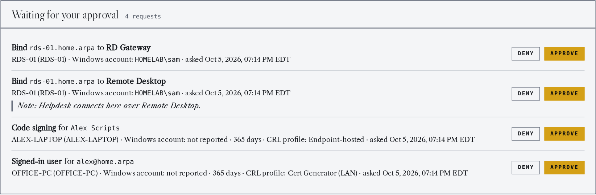
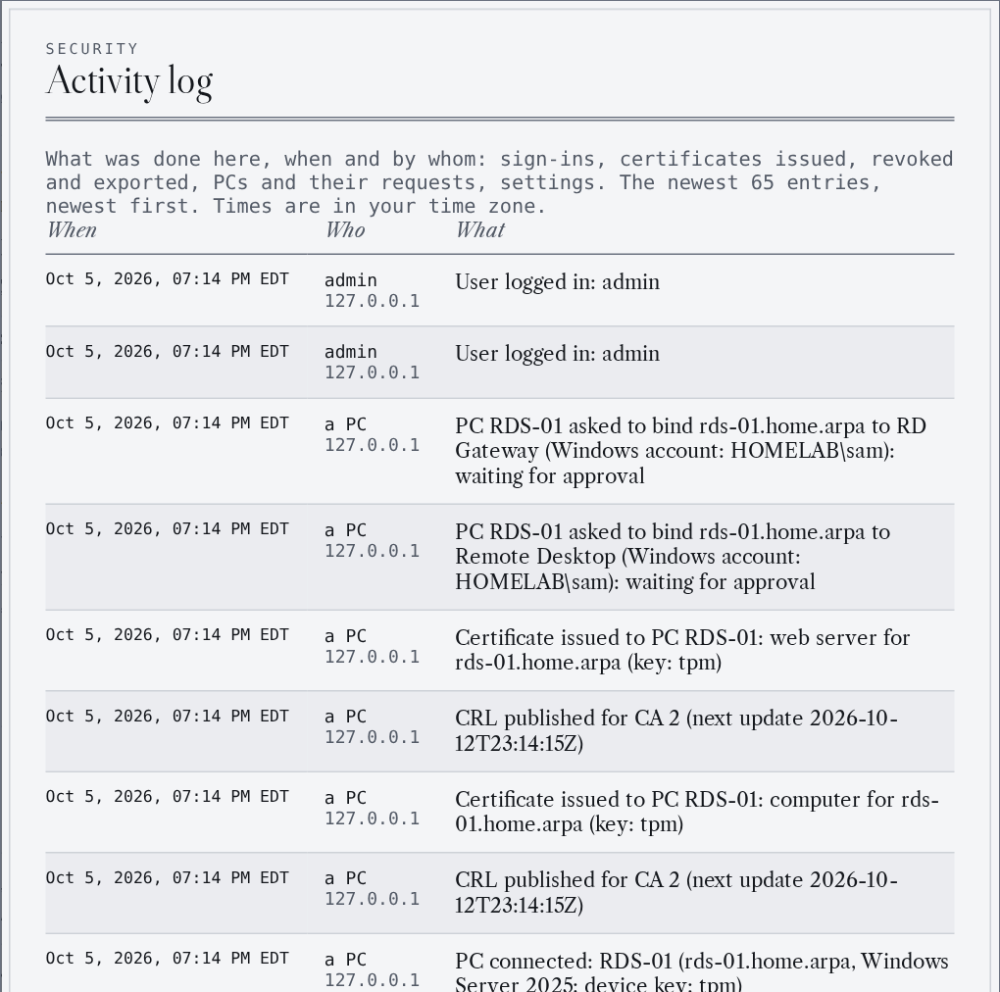

# Cert Generator

<!-- Dev-build banner: drawn by .github/workflows/dev-banner.yml after every release, empty when no pre-release is ahead of the latest release. -->
<a href="https://github.com/darthrater78/cert-generator/releases"></a>

**Your own certificate authority for the lab, the office and security demos.** Create root and intermediate CAs, issue certificates that match Windows CA templates, revoke them with a CRL clients can actually reach, and get every certificate onto the machine that needs it. Runs as a **Docker web app**.

[GitHub](https://github.com/darthrater78/cert-generator) · [v2.10.0-dev.3 release notes](https://github.com/darthrater78/cert-generator/releases/tag/v2.10.0-dev.3) · [What's new](CHANGELOG.md) · [Quick start](#quick-start) · [Cert Generator Pal](#cert-generator-pal-windows-pcs)

> [!IMPORTANT]
> **The standalone Windows EXE is deprecated.** Releases from v2.9.0 on are **Docker only**. [v2.8.0](https://github.com/darthrater78/cert-generator/releases/tag/v2.8.0) is the last EXE build: it stays available, keeps working and gets security patches only. To move to Docker, use **Backup** in the EXE and **Restore** in Docker. Details: [Standalone EXE](#standalone-exe-windows-desktop).

## New in 2.9

**Getting a certificate and putting it to work are now two steps, and you can approve both.** A PC requests its certificate; then it asks to **bind** it to Remote Desktop, WinRM, IIS, RD Gateway or the RD Connection Broker.



<sub><b>Waiting for your approval</b>: binds sit beside certificate requests, with who asked and their note.</sub>

| | |
|---|---|
| **Bind with approval** | Per PC and per role: *Off*, *Allow* or *Needs my approval*. [How binding works ↓](#binding-a-certificate) |
| **Edit a connected PC** | Change what it may request and bind, without a new pairing code |
| **Activity log** | Who did what, and when: sign-ins, certificates, exports, approvals |
| **Standards pass** | Certificates and CRLs checked against RFC 5280; clearer errors for names a certificate can't carry |
| **Docker only** | The standalone Windows EXE is deprecated; v2.8.0 is its last build |

Everything in the release: **[CHANGELOG.md](CHANGELOG.md)**.

## Meet Cert Generator Pal

**Stop copying .pfx files to Windows PCs.** Cert Generator Pal is a small Windows app that ships with the Docker version. Pair a PC once, and from then on it **requests, installs and renews its own certificates**.

<table>
<tr>
<td width="50%" valign="top"><br/><sub><b>On the server:</b> Add a PC gives a one-time pairing code.</sub></td>
<td width="50%" valign="top"><br/><sub><b>On the PC:</b> paste it into Cert Generator Pal and choose Connect.</sub></td>
</tr>
</table>

| 1 · Add a PC | 2 · Pair it | 3 · Request |
|---|---|---|
| On **Windows PCs**, choose **Add a PC**, pick what it may request, and copy the one-time code. | Run `CertGeneratorPal.exe` on the PC (it downloads from your server) and paste the code. | Choose a tile: **Web server**, **This computer**, **Me** or **Code signing**. It lands in the right Windows store in seconds. |

- **Keys are made on the PC and never leave it**: non-exportable, in the TPM when there is one. The server only ever sees certificate requests.
- **You stay in charge**: for each PC, every kind of certificate is off, issued right away, or waits for your approval.
- **Renewal is one click**, and everything bound to the old certificate moves to the new one by itself.
- **Works away from the LAN** through an end-to-end encrypted Cloudflare relay, without opening anything on your network.


<sub><b>Windows PCs</b>: every paired PC, what it may request, what it holds and what uses it, and everything waiting for your approval.</sub>

**[Read the Pal guide ↓](#cert-generator-pal-windows-pcs)**

## What it does


| | |
|---|---|
| **Certificate authorities** | Root and intermediate CAs with Ed25519, ECDSA P-256/P-384 or RSA-2048/4096 keys |
| **Certificates** | Templates matching a Windows CA (Web Server, Computer, Client Authentication, User, Code Signing, S/MIME), SANs with wildcards and IP addresses, and a viewer that reads like `openssl x509 -text` |
| **Getting them installed** | **Export / install** gives per-OS commands and a .zip with install scripts; PEM, DER, CRT and PKCS#12 files; **Cert Generator Pal** for Windows PCs |
| **Revocation** | A CRL served by this server, by a Cloudflare Worker per CA, or by each endpoint itself, and a CRL viewer |
| **SSH keys** | Generate or import, export as OpenSSH or PEM, and authorize on a server with one pasted line |
| **Security** | Encryption at rest with a recovery key, TOTP sign-in, trusted devices, a fresh sign-in before any private key leaves, encrypted backups |
| **Looks** | Six themes and an accent colour |

### Tour

<table>
<tr>
<td width="50%" valign="top"><br/><sub><b>Issue a certificate</b> from a Windows CA template, with the CRL address it carries.</sub></td>
<td width="50%" valign="top"><br/><sub><b>Export / install</b>: the files and the commands for Windows, macOS or Linux, or a .zip that installs itself.</sub></td>
</tr>
<tr>
<td width="50%" valign="top"><br/><sub><b>Certificate viewer</b>: every field and extension, fingerprints, and whether it's on the CRL.</sub></td>
<td width="50%" valign="top"><br/><sub><b>CRL viewer</b>: the published list, each revoked serial linked to its certificate.</sub></td>
</tr>
<tr>
<td width="50%" valign="top"><br/><sub><b>SSH keys</b>, generated here or imported.</sub></td>
<td width="50%" valign="top"><br/><sub><b>Encryption at rest</b>, with a one-time recovery key.</sub></td>
</tr>
<tr>
<td width="50%" valign="top"><br/><sub><b>Activity log</b>: who did what, and when. Never keys, passwords or pairing codes.</sub></td>
<td width="50%" valign="top"><br/><sub><b>CRL from a Cloudflare Worker</b>, set up from the app.</sub></td>
</tr>
<tr>
<td width="50%" valign="top"><br/><sub><b>Sign-in</b>, with optional TOTP and trusted devices.</sub></td>
<td width="50%" valign="top"><br/><sub><b>Themes</b>: six of them, and any accent colour.</sub></td>
</tr>
</table>

<details>
<summary><b>Every feature, in detail</b></summary>

**Certificate authorities and certificates**

- **Create Certificate Authorities** with configurable domain, name, algorithm, and lifetime
- **Intermediate CAs** — create subordinate CAs from any root CA; intermediates can issue their own certificates (intermediates are issued with path length 0, so they cannot create further CAs)
- **Issue leaf certificates** signed by any CA (root or intermediate), with SAN (Subject Alternative Name) support including wildcards and IP addresses
- **Certificate templates** matching Windows CA templates — Web Server, Computer, Client Authentication, User (Smart Card Logon), Code Signing, Email (S/MIME) — each with the correct key usage and extended key usage extensions
- **Modern crypto algorithms** — Ed25519, ECDSA P-256, ECDSA P-384, RSA-2048, RSA-4096
- **Standards-clean output** — certificates and CRLs follow RFC 5280:
  - key usage fitted to the key type; CRLs carry a CRL Number and Authority Key Identifier
  - nothing is valid past the CA that signed it
  - names are checked before signing; an international name is issued in its `xn--` form, and a host name over 64 characters keeps its full name in the SAN
  - the Issue Certificate form says when a choice will be refused somewhere: Ed25519 for a server, or a server lifetime over 825 days on Apple devices
- **Track all certificates** — view status (active/revoked/expired), details, and metadata
- **When things happened** — every certificate row shows when it was issued and, if so, when it was revoked
- **Certificate viewer** — click a certificate (or **View**) to read it like `openssl x509 -text`: every field and extension, fingerprints and the PEM, with Copy PEM and Export. **Show the issuing CA's CRL** adds whether the certificate is on it. The private key is never sent to the viewer

**Getting certificates installed**

- **Export / install** — on any certificate, **Export / install ▾** asks whether the CA chain is already on the machine, then gives:
  - copy-paste commands for Windows, macOS or Linux, with **Copy code** and a notice when PowerShell must run as Administrator
  - the right Windows stores: root → Trusted Root, intermediate → Intermediate CAs, computer certificates → Local Computer › Personal, user certificates → Current User › Personal
  - **Download .zip**: the certificate, the CA chain if needed, the CRL for an endpoint-hosted certificate, and install / uninstall scripts
  - an **Export file** tab for any single format
- **Export in multiple formats** — PEM, DER, CRT (.crt), PKCS12 (.pfx)
- **Export parts individually** — full bundle, certificate only, private key only, or full chain (cert + every issuing CA up to the root)
- **Password-protected exports** — optionally encrypt the private key (PEM); PKCS12 bundles always require a password you choose: there is no default, and the old pre-filled `changeit` is refused
- **Optional CA chain inclusion** — choose whether to bundle the issuing CA certificate when exporting issued certs
- **In-app certificate guide** — step-by-step instructions for importing certificates on Windows, macOS, and Linux for each template type

**Revocation**

- **Revoke certificates** to mark them as no longer trusted
- **CRL distribution point**, chosen per certificate. Details in [Revocation lists (CRL)](#revocation-lists-crl):
  - **this server** (`<address>/crl/<CA id>.crl`, answered without sign-in): a 7-day CRL (1 to 14 days, set per CA), re-signed on every revocation and renewed before it runs out
  - a **Cloudflare Worker** per CA, set up from the app: **Deploy**, **Test**, **Publish now**, **View live CRL**, **Delete Worker**
  - **endpoint-hosted** (`http://pki.<domain>/crl/<CA>.crl`, which no server answers): each machine gets the CRL from the install .zip or an import
- **Exported CRLs** stay valid as long as you choose (7 days to 10 years); the CA page shows the published CRL and the exported one separately
- **CRL viewer** — **View CRL** on the CA page shows what this server publishes: issuer, this and next update, every revoked serial linked to its certificate, fingerprints and the PEM
- **Revocation survives deletion** — deleting a revoked certificate keeps its serial on the CA's CRL until the certificate would have expired, and deleting a certificate that isn't revoked warns that clients keep trusting it

**SSH keys**

- **SSH key generation** — generate Ed25519, ECDSA P-256/P-384, and RSA-2048/4096 SSH key pairs with optional passphrase protection
- **SSH key import** — import existing SSH private keys from Bitwarden or other sources; supports OpenSSH, PEM PKCS#8, PEM traditional, and DER formats with automatic algorithm detection and optional passphrase; imported keys are visually marked and fully functional (export, copy, backup/restore)
- **SSH key export** — download private keys in OpenSSH or PEM (PKCS#8) format, copy public keys, or copy private keys for Bitwarden SSH import
- **Authorize on a server** — one line to paste on a Linux, macOS or Windows server that adds the public key to `authorized_keys` with the right permissions (Linux/macOS: `~/.ssh` 700, file 600, SELinux label restored; Windows: `administrators_authorized_keys` for administrators). Safe to paste twice

**Security**

- **Login authentication** — username/password login for server mode (first-launch setup, bcrypt-hashed passwords, session-based auth)
- **TOTP multi-factor authentication** — optional TOTP second factor using any authenticator app (Google Authenticator, Authy, 1Password, etc.); enable/disable from the MFA Settings panel, requires password + code to disable
- **Trusted devices** — "Trust this device for 30 days" skips MFA on subsequent logins; trust tokens are SHA-256 hashed and stored server-side with auto-detected device labels (browser + OS); view and revoke individual devices from Account Settings or MFA Settings
- **Step-up confirmation for key material** — downloading a private key (CA, certificate or SSH), copying an SSH private key, backing up and restoring all ask for your password, or an authenticator code when MFA is on, unless you signed in within the last 5 minutes
- **Database encryption** — encrypt all private keys at rest with AES-256-GCM using a master password derived via Scrypt; unlock screen on startup when enabled
- **Encryption recovery key** — enabling encryption shows a one-time recovery key; if you forget the master password, it unlocks the database and sets a new one (see [Forgotten encryption password](#forgotten-encryption-password))
- **Backup and restore** — export all data (CAs, certificates, SSH keys) to an AES-256 encrypted `.certbak` file; restore replaces all data from a backup. Backup files are portable between Docker and desktop — create on one, restore on the other
- **Activity log** — **Tools › Activity log** lists what was done, when and by whom: sign-ins, certificates issued, revoked, deleted and exported (and whether a private key left with them), PCs and what they asked for, approvals and settings changes. The newest 5,000 entries; never keys, passwords or pairing codes
- **Structured logging** — request and operation logging with timestamps, configurable via `LOG_LEVEL` environment variable

**Looks**

- **Themes and accent colour** — six themes (Slate by default, Flashbang, Graphite, Umber, Ink and OLED) and an accent colour picker (twelve presets, a colour picker or a typed hex value; brass by default), chosen from the Appearance menu and saved per browser; the sign-in pages follow the same choice
</details>

## Deployment options

| Mode | Best for | How it runs |
|------|----------|-------------|
| **Docker** (recommended) | Servers, shared access | Web app at `http://host:5000` with login authentication |
| **Standalone EXE** (deprecated: v2.8.0 is the last build) | Individual workstations | Native Windows window, downloaded from the release — no install needed |

**They are separate installs.** Each keeps its own database, and nothing syncs between them. To move your CAs, certificates and SSH keys from one to the other, use **Backup** in one to create an encrypted `.certbak` file and **Restore** it in the other (see [Data storage](#data-storage)). Backups go either way.

Both use the same interface and database format. Where they differ:

| | Docker | Standalone EXE |
|---|---|---|
| Access | Browser, from any machine that can reach it | Native window on one PC, no network port |
| Sign-in | User accounts, optional TOTP 2FA, trusted devices | Optional username + master password (turns on encryption) |
| CRL distribution point | **Cert Generator (Direct)** (this server), a **Cloudflare Worker**, or **endpoint-hosted** | Endpoint-hosted only: each machine gets the CRL from the install .zip or an import |
| Windows PCs (Cert Generator Pal) | Yes: PCs request and install their own certificates | No |
| Encryption at rest + recovery key | Optional | Optional |

For a CRL that clients fetch over the network, you need the Docker version.

## Quick start

1. Launch the app (Docker: `docker compose up -d`, Desktop: run `CertGenerator.exe`)
2. Server mode: create your admin account on first launch, then sign in. Desktop: choose whether to protect the app with a username and password
3. With no CA yet, the **Certificate Guide** opens on its Quick Start. **Open in new window** keeps it beside the app while you work
4. Click **+ New** next to **Authorities** (or **Tools › Create › New certificate authority**) and enter a domain name (e.g. `example.com`) and lifetime
5. Select your CA in the sidebar
6. Click **Issue certificate** to generate leaf certs
7. To trust the CA on a machine, **Download** it from the CA page: the default, **DER · Certificate Only**, is the file an endpoint needs
8. Click **Export / install ▾** on a certificate for step-by-step install commands or a .zip with install scripts, or its **Export file** tab to download it in the format you choose
9. Docker: for Windows PCs, open **Windows PCs**, download **Cert Generator Pal** and choose **Add a PC**: the PC then requests and installs its own certificates (see [Cert Generator Pal](#cert-generator-pal-windows-pcs))
10. Docker: to publish a CA's CRL on the internet, connect **Tools › Cloudflare** and deploy a Worker from the CA page (see [Cloudflare Worker CRL](#cloudflare-worker-crl))
11. Click **+ New** next to **SSH keys** to generate an SSH key pair, or **Tools › Create › Import SSH key** to add an existing key

## Install and run

### Docker (recommended)

**1. Create the data folder and move into it** (the container runs as UID 1000):

```bash
sudo mkdir -p /opt/docker/cert-generator && sudo chown 1000:1000 /opt/docker/cert-generator && sudo chmod 700 /opt/docker/cert-generator && cd /opt/docker/cert-generator
```

**2. Save this as `compose.yaml`** in that folder:

```yaml
services:
  cert-generator:
    image: ghcr.io/darthrater78/cert-generator:2.10.0-dev.3
    container_name: cert-generator
    restart: unless-stopped
    security_opt:
      - no-new-privileges:true
    ports:
      - "5000:5000"
    volumes:
      - /opt/docker/cert-generator:/data
    environment:
      - TZ=America/New_York
      - PORT=5000
      - SECRET_KEY=${SECRET_KEY:-}
      # - COOKIE_SECURE=true
      # - SETUP_TOKEN=${SETUP_TOKEN:-}

# image: pinned to a release. To upgrade, change the tag and run: docker compose pull && docker compose up -d
# no-new-privileges: the app never needs to gain privileges after it starts
# ports: the web UI on port 5000. Behind a reverse proxy, use "127.0.0.1:5000:5000" (see below)
#NOTE: this is only for scenarios where the proxy is on the same host as cert manager. 
# volumes: the database and exports live in /opt/docker/cert-generator on the host
# TZ: timezone for log timestamps
# PORT: the port the app listens on inside the container
# SECRET_KEY: signs session cookies; set it in .env (step 3) so sign-ins survive a restart
# COOKIE_SECURE: uncomment when the app is served over HTTPS
# SETUP_TOKEN: uncomment to require a token on the first-run setup page
```

**3. Set a session secret and start it:**

```bash
echo "SECRET_KEY=$(python3 -c 'import secrets; print(secrets.token_hex(32))')" >> .env && docker compose up -d
```

Open `http://<host>:5000` in your browser. On first launch you'll be prompted to create an admin account. The repository's [`docker-compose.yml`](docker-compose.yml) is the same file with longer comments, including the one-time account-recovery variables.

#### HTTPS and network exposure

The server speaks plain HTTP. For anything beyond a trusted LAN, put it behind a reverse proxy that terminates TLS (Caddy, nginx, Traefik), then:

- set `COOKIE_SECURE=true` so session and trusted-device cookies are only sent over HTTPS
- publish the port on loopback only (`"127.0.0.1:5000:5000"` in `compose.yaml`) so the proxy is the only way in
  NOTE: this is only for scenarios where the proxy is on the same host as cert manager. 
- set `SETUP_TOKEN` before first launch if the instance is reachable before you create the admin account

Proxies that rewrite the `Host` header should forward the original as `X-Forwarded-Host`; the cross-site request check accepts either.

### Standalone EXE (Windows desktop)

> **Deprecated: maintenance only, no new features.** Releases from v2.9.0 on are Docker only and carry no EXE.
>
> - **v2.8.0 is the last feature release of the EXE.** It stays available and keeps working.
> - A serious security issue in one of its dependencies still gets a patched build. Everything new goes into the Docker version.
> - **Why:** CRLs that clients can reach, Cloudflare publishing, Cert Generator Pal and the remote connection all need the server.
> - **To move across:** **Backup** in the EXE, **Restore** in Docker. The database format is the same.

Download `CertGenerator.exe` from the [v2.8.0 release](https://github.com/darthrater78/cert-generator/releases/tag/v2.8.0), the last one that includes the EXE ([direct download](https://github.com/darthrater78/cert-generator/releases/download/v2.8.0/CertGenerator.exe)). Newer releases are Docker only; if a security patch of the EXE is ever published, this link will name it. Double-click to run — no Python installation needed. The desktop app runs as a native window, and no network port is exposed.

On first run the app offers to **protect it with a username and password**. That turns on database encryption with the password as the master password, so the app asks for both at every start and a copied database file can't be read. Next it shows a one-time **recovery key**: if you forget the password, the sign-in screen takes the key, sets a new password and shows your username. You can skip it (**Not now**, or **Don't ask again**) and turn it on later in **Encryption** settings.

The EXE offers only the endpoint-hosted CRL distribution point. To serve a CRL that clients fetch, run the Docker version and move your data across with Backup and Restore.

The EXE is not code-signed, so Windows SmartScreen shows a warning on first run. To confirm the file is the one GitHub Actions built from this repository, compare it with the release's `CertGenerator.exe.sha256`, or verify its build attestation with the [GitHub CLI](https://cli.github.com/):

```bash
gh attestation verify CertGenerator.exe --repo darthrater78/cert-generator
```

To build it yourself on Windows:

```bash
pip install -r requirements-desktop.txt
python build.py
dist\CertGenerator.exe --self-test result.json
```

`--self-test` exercises the packaged app against a throwaway database without opening a window and writes the results to `result.json`; `--self-test-gui` also opens and checks the real window.

### Server mode (without Docker)

Run `python -m app.serve` (see [From source](#from-source)). It opens on `http://0.0.0.0:5000`. Same login and UI as Docker. Configure with environment variables:

| Variable | Default | Description |
|----------|---------|-------------|
| `PORT` | `5000` | Server port |
| `HOST` | `0.0.0.0` | Bind address |
| `SECRET_KEY` | random | Session secret (set for persistent sessions; an empty value also means random) |
| `COOKIE_SECURE` | `false` | Set `true` when served over HTTPS so cookies are HTTPS-only |
| `SETUP_TOKEN` | — | If set, the first-run setup page requires this token |
| `DB_DIR` | `~/.cert-generator` | Database directory |
| `EXPORT_DIR` | `~/Downloads` | Desktop mode only: where exports are saved. Server mode sends exports straight to the browser |
| `LOG_LEVEL` | `INFO` | Logging level (DEBUG, INFO, WARNING, ERROR) |
| `RESET_PASSWORD` | — | One-time: reset a user's password (`username:newpassword`), clear their trusted devices, and end their sessions |
| `RESET_MFA` | — | One-time: disable MFA, clear trusted devices, and end sessions for a user |

### From source

Needs Python 3.10+. For the web app (server mode):

```bash
pip install .
python -m app.serve
```

For the desktop app (pywebview), on Windows 10/11:

```bash
pip install ".[desktop]"
python -m app.main
```

This opens a native window with the full UI. App token authentication is handled automatically.

## Cert Generator Pal (Windows PCs)

Cert Generator Pal is a Windows companion app for the Docker version. Pair a PC once with a **one-time pairing code**; from then on it requests its certificates, installs them in the right Windows store, and renews them near expiry.

**The private keys are made on the PC, never leave it, and can't be exported** (in the TPM when the PC has one). The server only ever sees certificate requests.

### What a PC can get

| In the Pal | Certificate | Installed in |
|---|---|---|
| **Web server** | TLS server certificate for names beyond the PC's own: a website, an alias, a gateway's public name. Does nothing until it is bound | Local Computer › Personal |
| **This computer** | The computer's own certificate, named like a Windows CA names it. Works at once for Wi-Fi, VPN, 802.1X and device identity (posture checks); Remote Desktop, WinRM or a website use it once bound | Local Computer › Personal |
| **Me** | The signed-in user's client certificate (client authentication for Wi-Fi, VPN and websites) | Current User › Personal |
| **Code signing** | Signing scripts and programs | Current User › Personal |
| **TLS inspection** | Trusts your CA for HTTPS inspection (no request) | Local Computer › Trusted Root |

Only what the pairing code allows appears. The CA chain is checked before every install and any missing root or intermediate is added.

### Binding a certificate

**Getting a certificate and using it are two steps.** Installing a certificate only puts it in a Windows store. A service such as Remote Desktop or IIS keeps its own setting that points at one certificate, and never looks in the store by itself. **Binding** is changing that setting.

| 1 · Request | 2 · Bind | 3 · Approve (if you require it) |
|---|---|---|
| A tile in the Pal gets the certificate into the computer's store. | **Bind…** on that certificate: tick what should use it. | The bind waits on **Windows PCs** with who asked and their note. **Check again** in the Pal applies it. |

**No bind needed:** Wi-Fi, VPN and 802.1X sign-in, device identity checks, a browser offering a client certificate, and code signing all pick a certificate from the store by themselves.

**What can be bound**

| Role | Needs | What the bind changes on the PC | Remove |
|---|---|---|---|
| **Remote Desktop** | A certificate that carries the PC's own name | The RDP listener's certificate, and read access to its key for the Remote Desktop service | Goes back to Windows' self-signed certificate |
| **WinRM over HTTPS** | A certificate that carries the PC's own name | The HTTPS listener on port 5986 is switched to it, or created. WinRM must already be on; Windows Firewall isn't changed | The HTTPS listener is removed |
| **IIS site** | Any server certificate; for one name, a name the certificate carries | The site's https binding (port, and every name or one name) is added or switched. RD Web Access is an IIS site: bind it here | The https bindings that serve it are removed |
| **RD Gateway** | Any server certificate | The gateway's certificate; its service restarts, which disconnects people using it | Replace only: it can't run without one |
| **RD Connection Broker** | Any server certificate, on the broker itself | The certificates that sign RDP files and serve single sign-on | Replace only |

**You decide what a PC may bind.** **Add a PC** and **Edit** have a switch per role: *Off*, *Allow* or *Needs my approval*. PCs paired before 2.9 allow every role, as they always did.

<details>
<summary><b>See the switches in Add a PC</b></summary>


</details>

<details>
<summary><b>The finer points of binding</b></summary>

- **A role is offered when the certificate fits it**, whichever kind it is. Roles the PC doesn't run, roles you turned off, and roles whose name the certificate doesn't carry are greyed out with the reason.
- **A request the existing certificate covers is pointed to Bind.** A **Web server** request for nothing but the PC's own name, on a PC that already holds a **This computer** certificate, is refused with an offer to bind that one. Ask for a Web server certificate when you need other names.
- **Every bind is listed** in the Pal's Notes column, on the PC's card and on the certificate's row on the server. Removing a bind needs no approval.
- **Renewal** moves everything bound to the old certificate onto the new one first, including bindings made by hand.
- **A certificate issued in the web UI can be bound too.** Install it in the computer's store with its key (the Windows bundle from **Export / install** does this) on a PC paired with the same CA, and it appears in the Pal with **Bind…**. Its key was made on the server, so it is not in the TPM and the Pal can't renew it.
- **The switches govern what the Pal does.** An administrator on the PC can still bind a certificate by hand in Windows; it then shows in Notes like any other.

</details>

### Using the Pal

| Button | What it does |
|---|---|
| **A tile** | Requests that kind of certificate. *Issue right away* installs it in seconds; *Needs approval* waits for you, and **Check again** installs it once approved |
| **Bind…** | Tells a Windows service to use the selected certificate, or takes it out of use. See [Binding a certificate](#binding-a-certificate) |
| **Renew** | Opens in a certificate's last 30 days (the last third for short-lived ones). Makes a new key, moves every bind to the new certificate, then revokes the old one |
| **Remove** | Takes one or several certificates off this PC and has the server revoke them, if this PC was issued them. The confirmation says so (**ALSO REVOKED**), and warns first when something still uses one. A certificate that names no CRL can't be revoked: it is removed and reported as gone (**NOT REVOKED**) |
| **Revoke** | Has the server revoke it and leaves it on the PC, marked revoked. Unavailable for a certificate that names no CRL |
| **View** (on a CRL row) | Shows the CRL that address serves now: issuer, dates and every revoked serial, marking the ones on this PC |
| **Publish CRL now** | Asks the server to sign its CRL again and publish it, here and to its Cloudflare Worker |
| **Clear cached CRLs** | Deletes your Windows account's cached copies of this CA's CRLs, so Windows fetches them again at the next check. For testing a revocation |
| **Force re-check now** | Makes every account, service and running program fetch again what it cached before now (`ChainCacheResyncFiletime`). Asks for administrator approval |
| **How Windows checks** | A guide to how Windows handles a CRL: when it looks, how long it keeps a copy, and what happens when the copy runs out |
| **Details** | The full certificate: every field and extension, the chain, and where the key lives |
| **Theme** (in the footer) | The web app's six themes, or **Match Windows** (Slate in light mode, Ink in dark; the default). Choosing one restarts the Pal |
| **Refresh** | Re-checks the server, the CRL and the list |
| **Disconnect this PC** | Removes the pairing and every certificate it installed |

**The certificate list** shows every certificate on the PC that chains to your CA, in the user's and the computer's stores, with the server's view of each (valid, revoked, expired), where its key lives, and what uses it. Click a heading to sort.

<details>
<summary><b>Rules the Pal and the server keep</b></summary>

- **One live certificate** per PC, kind and name: the server refuses duplicates and early renewals.
- **Who asked:** each request and bind carries the Windows account the Pal ran as (reported by the Pal, not attested) and an optional one-line **note for the admin**.
- **Shared PCs:** a **Me** or code-signing certificate lives in one person's own store, so only the account that asked for it can report it missing. Someone else signing in never frees its name or gets it revoked.
- **Me is for client authentication** (Wi-Fi, VPN, websites that ask for a certificate). Signing in to Windows with it is not supported.
- **Offline revocation:** if the server can't be reached, a Remove or Revoke is saved on the PC and sent at the next check-in.
- **The two sides keep each other informed.** When the server revokes a certificate, the Pal shows a notice at its next check-in. When a certificate disappears from the PC some other way, the server lists it as **no longer on the PC, not revoked**; it never revokes on absence alone.
- **Only the server signs CRLs.** It re-signs and republishes on every revocation; the Pal only fetches the new one.

</details>

<details>
<summary><b>CRL profiles, connectivity and the log</b></summary>

- **CRL profiles:** switching profile backs out the current one first (its certificates leave the PC); the root CA stays trusted. **Endpoint-hosted** adds a small listener on the PC that answers its own revocation checks, for laptops away from the LAN. The profile is locked while the server can't be reached.
- **Connectivity** is one line per section, each saying how that section is doing. Click a section's name to open or close it; a section with a problem opens by itself and shows its links. **Cert server** shows **Direct**, and **Remote** through the relay when the PC has one. **CRL** shows the profile's CRL, marked **IN USE**, and the other CRLs the server publishes (a **No CRL** profile says its certificates can't be revoked). **Windows cache** shows the copy of each CRL that Windows itself holds for your account (**BEHIND** when the server has published a newer one, **CURRENT** when it matches) and when a re-check was last forced. **This PC** shows where keys are stored. Each row has a coloured status and **Test**; CRL rows also have **View**.
- **Key storage** says whether the keys the Pal makes on this PC live in its **TPM** or in Windows' software key store. The list's **Key** column says the same for each certificate.
- **Log** shows the Pal's log, with a **Debug logging** switch (every request and check; never keys or pairing codes).
- **Files:** pairings in `C:\ProgramData\CertGeneratorPal` (written only with administrator approval); the log in `%LOCALAPPDATA%\CertGeneratorPal\pal.log`.

</details>

### Managing PCs

The **Windows PCs** page ([pictured above](#meet-cert-generator-pal)) lists each PC with what it may request, its CRL profiles, what its last check-in found installed and what uses it, its Pal version and how its last request arrived.

| On a PC's card | What it does |
|---|---|
| **Approve** / **Deny** | Answers a certificate request or a bind waiting in the list |
| **Edit** | Changes the certificate kinds and their approval, the bind switches, allowed names and longest lifetime. The PC picks it up at its next check-in; no new pairing code. CRL profiles can be changed here too |
| **Allow** / **Turn off** | Remote access through the relay |
| **Disconnect** | The PC can't request again, and its certificates are revoked (those that name a CRL) |
| **Delete** | Takes it off the list |

Pairing codes that haven't been used can be revoked. A PC whose Pal comes from another release is flagged, so you know to update it from the server.

### How it stays secure

- **Keys stay on the PC**, non-exportable. The Pal makes each key in the PC's **TPM** and falls back to Windows' software key store only when there is no usable TPM; there is nothing to configure.
  - A TPM key can't be copied off the PC, even by an administrator.
  - A software key is marked non-exportable, but an administrator on that PC can still extract it.
  - The server stores no Pal private keys.
- **Where each key ended up is shown**: **TPM**, **Software key** or **Not reported**, on the **Windows PCs** page, in a CA's certificate list and in the Pal's certificate viewer. The Pal reports this itself; it is not TPM attestation, so treat it as inventory, not proof.
- **Pairing** proves both sides hold the code's secret without sending it, and **pins your root CA**: a server or network in the middle can't plant another CA.
- **Every request is signed** by the PC's own device key, with a timestamp and a single-use nonce. What a PC may ask for is enforced by the server, not the app.
- **LAN only**: the server answers the Pal's API only from private addresses (RFC 1918, CGNAT `100.64.0.0/10` for SSE / ZTNA overlays such as Tailscale or Zscaler, link-local, IPv6 ULA), and the Pal connects only to such addresses. Don't publish `/api/pal/` through an internet-facing reverse proxy; use the remote connection instead.
- **Disconnecting** a PC revokes its certificates; a renewal revokes the certificate it replaces. A certificate with no CRL distribution point is never revoked, because nothing would check.

### Remote connection (PCs away from the LAN)

A PC allowed remote access keeps requesting and renewing when it isn't on your LAN, through a **relay Worker** on your Cloudflare account. **Nothing on your network opens to the internet**: your server connects *out* to the Worker and collects the requests waiting there.


1. Turn on **database encryption** and connect **Cloudflare** (**Tools › Cloudflare**) if you haven't: the relay's keys are only ever stored encrypted.
2. On **Windows PCs › Remote connection**, choose **Set up remote connection**. It deploys a relay Worker on your `workers.dev` subdomain and the server starts collecting from it. **Check now** shows the server collecting within a minute.
3. **Allow** remote access for a PC on its card (or tick **Allow remote connection** when you make its pairing code).
4. The PC learns the relay the next time it checks in **on the LAN**. From then on, when the LAN can't be reached, each request goes through the relay instead. In the Pal, **Remote** under **Cert server** shows the relay, and **Connect to remote** uses only the relay for the session (to test it).

**What Cloudflare can and can't see**

- It sees a PC's device id, sizes and times. Nothing else.
- Each request is **end-to-end encrypted** to a key only your server holds (a one-time P-256 key per request, AES-256-GCM), and each reply to a key only the sender can derive. The Worker can't read, change or replay either.
- The Worker only takes envelopes signed by a PC you allowed, and **pairing never goes through the relay**.
- **Remove** deletes the Worker; the relay key stays, so PCs pick up a new relay without pairing again.

### Troubleshooting

<details>
<summary><b>What the Pal's messages mean</b></summary>

| The Pal says | What to do |
|---|---|
| **Wrong domain.** / **No DNS suffix.** | The PC's full name must fit the code's allowed DNS names; set the PC's primary DNS suffix, or allow its domain on a new code |
| **Code already used / expired / revoked.** | Make a new pairing code |
| **… isn't a LAN address.** | The server address resolves to a public address: use its LAN name or address (or set up the remote connection) |
| **Clock wrong.** | The PC's clock is more than 5 minutes off the server's |
| **Not allowed.** / **Revocation type not allowed.** | The pairing doesn't allow that; make a new code with it |
| **Too early to renew.** | Renewal opens in the certificate's last 30 days |
| **IIS refused.** / **No such site.** | Check the site name in IIS Manager; the log has appcmd's full answer |
| **Remote Desktop isn't set up.** | Turn on Remote Desktop in Settings, then **Bind…** again |
| **Remote access refused.** | Allow remote for the PC on the Windows PCs page; the relay hears about it within a minute |
| Windows SmartScreen blocks the EXE | It's unsigned: **More info › Run anyway**, after checking its SHA-256 on the Windows PCs page |

</details>

For anything else, turn on **Log › Debug logging** in the Pal and look at the log; the server's log has the matching entries. The design, protocol and relay envelope are documented in [docs/cert-generator-pal.md](docs/cert-generator-pal.md).

## Revocation lists (CRL)

A certificate can carry a CRL distribution point: the address clients check to learn it was revoked. There are three kinds, picked per certificate when you issue it: **this server** (Docker), a **Cloudflare Worker** (Docker), or **endpoint-hosted**, where each machine answers its own revocation check.

### Publishing the CRL

Certificates issued with the **Cert Generator (Direct)** distribution point name `<address>/crl/<CA id>.crl`, where `<address>` is the one typed in the Issue Certificate dialog (it defaults to the address you are using).

- **That path is the only one that answers without signing in.** Unknown, unpublished and never-opted-in CAs all get the same `404`.
- **The app signs the CRL itself**, the first time a certificate names this server. Nothing is signed per request.
- **It stays current:** each served CRL is valid for 7 days, is re-signed on every revocation, and an hourly check renews it when less than half its life is left.
- **A revocation reaches clients within 7 days**, because they cache a CRL until its next update.
- **To shorten that,** set **Published CRL valid for** on the CA page to 1, 2, 3, 7 or 14 days. It applies to the CRL this server serves and to the CA's Cloudflare Worker, and the CRL is re-signed at once. A shorter CRL is the only thing that shortens the wait for every client; the cost is that clients have no usable CRL sooner when the server or Worker is down (after about half the lifetime).

With an encrypted database, signing needs the CA key, so revoking a certificate of a CA served here is refused while the database is locked, and renewals wait until it is unlocked (the served CRL keeps answering meanwhile). **Export CRL** is for the endpoint-hosted distribution point and offline import: it downloads a CRL with the lifetime you choose and never replaces the one this server serves. After you revoke a certificate whose CRL is endpoint-hosted, the app offers that updated CRL for download. A certificate issued with no CRL distribution point can't be revoked: nothing would check, so **Revoke** is unavailable for it and a disconnected PC's copies are left as they are.

If clients reach the app through a reverse proxy, expose `/crl/` alone to them and keep everything else private. Allow only `GET` and `HEAD` on `^/crl/[0-9]+\.crl$`. Revocation checks are usually plain HTTP (clients don't fetch a CRL over HTTPS to avoid a circular check), so the CRL vhost is often HTTP while the admin UI stays on HTTPS.

nginx:

```nginx
server {
    listen 80;
    server_name pki.example.lan;

    location ~ ^/crl/[0-9]+\.crl$ {
        limit_except GET { deny all; }  # GET also allows HEAD
        proxy_pass http://127.0.0.1:5000;
    }
    location / { return 404; }
}
```

Traefik (compose labels on the `cert-generator` service):

```yaml
labels:
  - traefik.enable=true
  - traefik.http.routers.crl.rule=Host(`pki.example.lan`) && PathRegexp(`^/crl/[0-9]+\.crl$`) && (Method(`GET`) || Method(`HEAD`))
  - traefik.http.routers.crl.entrypoints=web
  - traefik.http.services.crl.loadbalancer.server.port=5000
```

The desktop app can't serve CRLs (it listens on loopback only), so it offers the endpoint-hosted distribution point alone.

### Cloudflare Worker CRL

For clients that can't reach this server, each CA can publish its CRL from its own [Cloudflare Worker](https://developers.cloudflare.com/workers/), on Cloudflare's free plan. Everything happens in the app; there is no `wrangler` or command line. Docker only: the EXE never stores a Cloudflare token.


**1. Connect (once).**

- Turn on **database encryption** first. The API token can rewrite your CRL Workers, so it is only ever stored encrypted, and the app can't use it while the database is locked. Encryption can't be turned off while Cloudflare is connected.
- Open **Tools › Cloudflare** and create a custom API token in the Cloudflare dashboard with **Account · Workers Scripts · Edit** on your account only.
- For an address on your own domain, add **Zone · Zone · Read**, **Zone · Workers Routes · Edit** and **Zone · DNS · Edit** for that one zone.
- Paste the token with your account ID. It is checked with Cloudflare and never shown again.

**2. Deploy per CA.** On the CA page, the **Cloudflare Worker for CRL** card deploys a Worker for that CA at `certgen-crl-<CA>-<random>.<your subdomain>.workers.dev`, or at a hostname on one of your Cloudflare domains (Cloudflare creates the DNS record). Pick an address you'll keep: it is written into every certificate issued with it. Then issue certificates with **Include CRL Distribution Point › Cloudflare Worker (this CA)**.

**3. Test.** **Test** fetches the CRL from the Worker over plain HTTP and HTTPS, from this server, and checks that it parses, is signed by the CA, is current and matches what the app last pushed. It recommends the address to put in certificates: plain HTTP with no redirect where that works, since Windows and most clients fetch CRLs over HTTP. **View live CRL** opens the CRL the Worker is serving in the CRL viewer, and **Copy** gives the address for your own testing (`certutil -url`, `openssl crl`).

**Keeping it current.** The CRL is built into the Worker, so publishing is a redeploy. Revoking a certificate asks to confirm and pushes the new CRL; the hourly renewal re-signs and pushes it before it runs out (7-day CRLs unless the CA is set otherwise, renewed at half-life); **Publish now** does it by hand. A failed push shows **not published** on the CA page and in the log, and is retried hourly. **Refresh** re-reads the Worker and checks it still exists in Cloudflare.

**Cleaning up**

- **Delete Worker** deletes the CA's Worker (and its custom domain). The confirmation says how many certificates carry its address, since they lose their working CRL.
- **Tools › Cloudflare** lists every `certgen-crl-*` Worker in the account, with **Delete** and **Delete unlinked**:
  - **in use**: a CA here publishes through it
  - **unlinked**: in Cloudflare, but no CA here uses it (a deleted CA, a failed setup, a restore or another install of the app)
  - **missing**: a CA here names a Worker Cloudflare no longer has
- **Disconnect** deletes the stored token (delete it in the Cloudflare dashboard too). It needs a recent sign-in and is refused while any CA still has a Worker, since the app could no longer update or remove it.


**Security.** The Worker's code is fixed and contains no secrets: it answers `GET` and `HEAD` on its one CRL path, `404`/`405` for anything else, sets no cookies and no CORS headers, and sends `nosniff` and a `default-src 'none'; sandbox` CSP. Nothing on it can write; changing the CRL takes the API token, which stays encrypted in this app's database. A CRL is public by design and signed by the CA, so a Worker can't forge one.

### Endpoint-hosted CRL, for endpoints that can't reach Docker or Cloudflare (Windows)

A certificate with the **endpoint-hosted** distribution point names `http://pki.<domain>/crl/<CA name>.crl`, an address no server on the network answers. (Older versions called it *placeholder*; the API value is still `placeholder`.) Windows' own revocation check can still use a CRL imported into the certificate store, but programs that download the CRL from that address (some agents, browsers, Java, OpenSSL-based tools) get nothing. For endpoints that can reach neither this server nor a Cloudflare Worker, the Windows install bundle makes the endpoint answer that address itself.

**Get it:** on the certificate, open **Export / install ▾**, choose **Windows**, answer the CA question, and use **Download .zip**. For an endpoint-hosted certificate the zip holds the CRL, `install.cmd` / `install.ps1`, `uninstall.cmd` / `uninstall.ps1`, `serve-crl.ps1` and a `README.txt` that repeats everything below.

**Install:** extract the zip anywhere and double-click **`install.cmd`**. It asks for administrator rights, shows each command before running it, stops with an explanation if a step fails, and waits for Enter before the window closes. It's safe to run again.

The scripts are unsigned, so Windows' default execution policy blocks running `install.ps1` directly ("running scripts is disabled on this system").

- **`install.cmd` isn't subject to that policy.** It starts the script with the policy bypassed for that one run; your setting doesn't change. The PowerShell equivalent is `powershell -ExecutionPolicy Bypass -File .\install.ps1`.
- **"Publisher can't be verified":** choose **Run**. Unblocking the .zip first (**Properties › Unblock**) avoids the warning.
- **A Group Policy that enforces `AllSigned`** overrides the bypass. Then run the commands from **Export / install** by hand.

<details>
<summary><b>What the install changes on the PC</b></summary>

Besides the certificate (and the CAs, if included), it changes only:

| What | Where | Why |
|---|---|---|
| Hosts entry `127.0.0.1 pki.<domain> # cert-generator` | `C:\Windows\System32\drivers\etc\hosts` | Sends the CRL's host name to this machine, and only on this machine |
| The CRL, `serve-crl.ps1`, `crl-hosts.txt` | `C:\ProgramData\CertGenerator` | Writable by Administrators and SYSTEM only, readable by LOCAL SERVICE |
| CRL import | Local Machine › Intermediate Certification Authorities | For Windows' own revocation check |
| URL reservation for `http://pki.<domain>:80/crl/` | `netsh http show urlacl` | Lets LOCAL SERVICE answer that one path, nothing else |
| Scheduled task **Cert Generator CRL server** | Task Scheduler | Starts the listener at boot as LOCAL SERVICE |

The listener is a few lines of PowerShell on Windows' built-in HTTP.sys (the same component IIS uses, so it shares port 80 with IIS). It answers `GET` and `HEAD` for `/crl/<name>.crl` from that folder and `404` for everything else. Several CAs and domains share one listener. The script finishes by downloading the address itself and stops with an error if nothing answers. Check it any time with `certutil -verify -urlfetch <certificate.cer>`.

</details>

**After a revocation:** nothing updates the endpoint's copy by itself. Download a new bundle and run its `install.cmd`: it replaces the CRL and restarts the listener. Until then the endpoint doesn't see the revocation.

**Back out:** double-click **`uninstall.cmd`** in the same extracted folder (keep it for this). Like the install, it asks for administrator rights, shows each step and waits before closing; it carries on past a failed step and lists what it couldn't remove. From PowerShell:

```powershell
powershell -ExecutionPolicy Bypass -File .\uninstall.ps1            # asks before removing CA certificates
powershell -ExecutionPolicy Bypass -File .\uninstall.ps1 -RemoveCA  # removes them without asking
```

It removes the certificate, the imported CRL, the hosts line, the URL reservation and this domain from the listener. With the last domain gone it also deletes the scheduled task and `C:\ProgramData\CertGenerator`. Use the `uninstall.ps1` from the last bundle you installed: it names the current CRL. To back out by hand: delete the `# cert-generator` line from the hosts file, run `netsh http delete urlacl url=http://pki.<domain>:80/crl/`, delete the **Cert Generator CRL server** task and `C:\ProgramData\CertGenerator`, and remove the certificate and CRL in `certlm.msc`.

<details>
<summary><b>Security notes</b></summary>

- **Exposure:** HTTP.sys accepts the request on any interface, but Windows Firewall blocks inbound port 80 unless you open it, and the only thing served is the CRL, which is public by design.
- **Tampering:** a CRL is signed, so it can't be forged, but an older valid copy could hide a revocation. That's why the folder is admin-only. If it already exists and isn't owned by Administrators (any user can create folders in `C:\ProgramData`), or is a link, the install moves it aside as `CertGenerator.untrusted-<time>` and starts fresh, so nobody else can swap the script the listener runs. The listener runs as LOCAL SERVICE, not SYSTEM, and may use only the reserved path.
- **Freshness** is the real weakness: an endpoint that isn't given the new CRL keeps trusting a revoked certificate until the old CRL expires.
- **Security tools** may flag the hosts-file edit and the new startup task. That is this install; undo it with `uninstall.cmd`.
- **Port 80** taken by a program that doesn't use HTTP.sys (Apache, nginx, some Docker setups) stops the listener. `install.cmd` reports it.
- **A system-wide proxy** (`netsh winhttp show proxy`) needs `pki.<domain>` on its bypass list.

</details>

macOS and Linux bundles include the CRL file, but the local CRL server is Windows-only for now.

## Server hardening

The embedded web server is hardened for both desktop and server use.

<details>
<summary><b>Desktop mode, server mode and both: the full list</b></summary>

**Desktop mode (pywebview):**
- **Loopback only** — binds to `127.0.0.1`, never exposed to the network
- **Random port** — uses an ephemeral port each launch, not a fixed port
- **App token authentication** — a random token is generated at startup and set as an httpOnly cookie via the pywebview window; requests without the cookie are rejected with 403, preventing access from other browsers on the same machine
- **Auto-shutdown** — the server thread is daemonic and shuts down when the window closes

**Server mode (Docker / standalone):**
- **Login authentication** — on first launch, you create an admin account (optionally gated by `SETUP_TOKEN`); all subsequent access requires sign-in with username and password (bcrypt-hashed, session-based)
- **Brute-force protection** — repeated failed passwords, MFA codes, encryption passwords, or recovery keys lock that account's attempts for 1 minute, doubling up to 15 minutes. Trusted devices are unaffected
- **TOTP MFA** — optional second factor via any authenticator app; enable per-user from MFA Settings. Each code is accepted only once
- **Trusted devices** — "Trust this device" sets an httpOnly cookie with a SHA-256 hashed token; auto-login skips password and MFA for 30 days unless "Require password every visit" is enabled. Signing out forgets the device
- **Session revocation** — password resets, MFA changes, "Revoke all devices", and backup restores end every other session
- **Step-up confirmation** — private-key downloads (CA and certificate keys, any bundle that includes a key, SSH private keys in any format), backup and restore require a password or authenticator-code sign-in within the last 5 minutes; otherwise the page asks for one and retries. Confirmations share the sign-in lockout, and a trusted-device auto-login doesn't count as one. Desktop mode has no accounts (its optional sign-in is the encryption password) and is exempt
- **Session cookies** — httpOnly, `SameSite=Lax`, signed with `SECRET_KEY`; `Secure` when `COOKIE_SECURE=true`
- **Cross-site request protection** — state-changing requests from other sites are rejected (using `Sec-Fetch-Site`, falling back to `Origin`)
- **Internal API** — the routes under `/api/` are the page's own API, authenticated by the session cookie. They are not a stable public interface and can change between releases
- **Cloudflare token** — stored only encrypted with the database key (connecting requires encryption), never returned by the API, unusable while the database is locked, and scoped by you to Workers Scripts (plus one zone for a custom domain). Cloudflare calls go only to `api.cloudflare.com` with certificate verification
- **Public CRL path** — `/crl/<id>.crl` is the one unauthenticated route. It accepts only `GET` and `HEAD`, serves only CAs that opted in by issuing a certificate pointing at this server, answers unknown and unpublished CAs with the same `404`, never reads or sets a session cookie, sends the CRL as an attachment under `Content-Security-Policy: default-src 'none'` with an `ETag`, and is rate limited to 300 requests a minute per client address
- **Security headers** — a Content-Security-Policy that allows no inline script (`script-src 'self'`), `X-Frame-Options: DENY`, `nosniff`, and `Cache-Control: no-store` on API responses
- **No key material on the server's disk** — exports and backups stream to the browser instead of being written to an export folder. If an older version left export files in `EXPORT_DIR`, a banner offers to review and delete them (only files matching the old export names are touched)
- **Clean shutdown** — `docker stop` ends the server immediately instead of waiting for its timeout
- **Patched, minimal image** — the image applies Debian security updates at build time rather than waiting for the base image to be rebuilt, and drops `pip` (with the libraries it bundles) once the app's dependencies are installed

**Both modes:**
- **Encryption fails closed** — while an encrypted database is locked, anything that would store a private key is refused rather than written in plaintext
- **Clean exit** — `sys.exit(0)` after the UI closes ensures proper cleanup

</details>

### Account recovery

If you lose your password or MFA authenticator, use environment variables to reset on the next container start. These run once at startup — remove them afterward.

**Reset a password:**

```bash
# Docker
docker compose exec cert-generator env RESET_PASSWORD=admin:newpassword python -m app.serve &
# Or add to compose.yaml environment section, restart, then remove it
```

**Disable MFA for a locked-out user:**

```bash
# Docker
docker compose exec cert-generator env RESET_MFA=admin python -m app.serve &
# Or add to compose.yaml environment section, restart, then remove it
```

**Without Docker:**

```bash
RESET_PASSWORD=admin:newpassword python -m app.serve
RESET_MFA=admin python -m app.serve
```

`RESET_MFA` disables TOTP, clears all trusted devices, and turns off "Require password every visit" for the named user. `RESET_PASSWORD` also clears the user's trusted devices. Both end every existing session for that user, so recovering from a compromised account locks the intruder out. Neither variable affects database encryption — the master encryption password is separate from the login password.

With both MFA and database encryption enabled, the MFA page asks for the encryption password after a restart, because the MFA secret is encrypted too. Entering it also unlocks the database. If you've forgotten it, **Forgot it? Use your recovery key** on the same page takes the recovery key and a new encryption password instead.

### Forgotten encryption password

The account-recovery variables can't help here: nobody can decrypt the keys without the master password or the **recovery key**. The recovery key is shown once when you enable encryption, as five groups of five characters (`K7QM2-XR4TD-…`). Store it away from the server, in a password manager or on paper. Anyone with it and a copy of the database can read your private keys.

- **To use it**, choose **Forgot it? Use your recovery key** on the unlock screen (or on the MFA page), enter the key and a new master password. The database unlocks, and a **new recovery key** replaces the one you typed, which stops working. Case, spaces and dashes don't matter.
- **To replace it** (lost, or possibly seen), open **Encryption** settings and choose **Replace recovery key** with your current password. The old key stops working.
- **Databases encrypted before v2.6.0** have no recovery key. Their next unlock upgrades them to the new format, and a banner offers **Create recovery key**.
- Changing the master password keeps the recovery key valid. Disabling encryption removes it.

This works the same in Docker and the Windows EXE. In the EXE, if you set a username, recovery also shows it.

## Supported algorithms

| Algorithm | Key type | Hash |
|-----------|----------|------|
| Ed25519 | EdDSA | Built-in |
| ECDSA P-256 | Elliptic curve | SHA-256 |
| ECDSA P-384 | Elliptic curve | SHA-384 |
| RSA-2048 | RSA | SHA-256 |
| RSA-4096 | RSA | SHA-384 |

## Export formats

| Format | Extension | Contents |
|--------|-----------|----------|
| PEM | `.pem` | Base64-encoded, widely supported |
| DER | `.der` | Binary format |
| CRT | `.crt` | DER-encoded with Windows-native extension |
| PKCS12 | `.pfx` | Bundled cert + key, password required |

Export options per certificate:
- **Certificate + Key** — full bundle
- **Certificate Only** — public certificate
- **Private Key Only** — private key
- **Full Chain** — leaf cert + issuing CA cert + root CA cert (PEM only, for leaf certs)

A CA's export defaults to **DER · Certificate Only**, which is all an endpoint needs to trust the CA, including PCs behind TLS inspection that must trust what the inspecting device presents. Export a CA's **Certificate + Key** only for the one device that signs certificates as this CA, such as the firewall or proxy that performs TLS inspection, or to move the CA to another server; never install it on endpoints. CA files are named after the CA (`ca-<CA name>-certificate.der`), certificate files after the common name (`<common name>-certificate.pfx`).

## Data storage

All CAs, certificates, and SSH keys are stored in a SQLite database. When database encryption is enabled, all private keys (and the MFA secrets) are encrypted at rest with AES-256-GCM under a random 256-bit data key. The database stores that key only wrapped: once with a key derived from the master password (Scrypt), and once with one derived from the recovery key (HKDF; the recovery key is 125 random bits). Changing the password re-wraps the data key without re-encrypting anything. Backups are separate: a `.certbak` holds the decrypted data, sealed with the backup password you choose.

| Mode | Database path | Exports path |
|------|--------------|--------------|
| **Desktop** | `~/.cert-generator/certs.db` | `~/Downloads/` |
| **Docker** | `/data/db/certs.db` (host: `/opt/docker/cert-generator/db/`) | Downloaded by your browser; nothing is kept on the server |

The database format is identical in both modes. Use **Backup** to create an encrypted `.certbak` file on one and **Restore** to load it on the other — this is the supported way to migrate data between Docker and desktop.

## Development

### Running tests

```bash
pip install -r requirements-dev.txt
python -m pytest
```

Browser tests drive the real UI (downloads, sign-out, CRL export, mobile layout) with Playwright and check for JavaScript and Content-Security-Policy errors:

```bash
pip install -r requirements-e2e.txt
python -m playwright install --with-deps chromium firefox webkit
python -m pytest -m e2e --browser chromium --browser firefox --browser webkit
```

Security scans before a release: Bandit and pip-audit come with `requirements-dev.txt`, and [Trivy](https://github.com/aquasecurity/trivy/releases) (a standalone binary) scans a built image with the same config CI uses:

```bash
bandit -r app -c pyproject.toml
pip-audit -r requirements.txt -r requirements-desktop.txt
docker build -t cert-generator:dev . && trivy image --config trivy.yaml --ignorefile .trivyignore.yaml cert-generator:dev
```

Editing a file under `.github/workflows/`? Lint it the same way CI does:

```bash
bash scripts/lint-workflows.sh
```

CI runs on every push and pull request to `master`:
- the unit tests on Linux (Python 3.10 and 3.14)
- the browser tests in Chromium, Firefox, and WebKit
- a Docker image build with a container smoke test, including a clean shutdown on `docker stop`, and a Trivy scan of the image's OS and Python packages (report only)
- `actionlint` against `.github/workflows/**` (only runs when those files change)
- dependency review on pull requests, which fails a PR that adds a dependency with a known high or critical advisory

A change that touches only documentation (`*.md`, `docs/**`, `LICENSE`) skips the tests, browser tests and image build: a first `detect changes` job decides with `scripts/ci-changes.sh`, and the skipped jobs still report as passing, so required checks and the release workflow's CI check are satisfied. If that job fails or can't tell what changed, everything runs.

### Releases

Pushing a `vX.Y.Z` tag on `master` runs `.github/workflows/release.yml`. Before building anything, it requires a passing CI run for the tagged commit — an in-progress run is waited on, but a missing or failed one stops the release. Both deliverables share one version line, and the changelog decides which of them a release publishes: the version's entry in [CHANGELOG.md](CHANGELOG.md) must carry a `#### Docker` section, a `#### Windows EXE` section, or both, and at least one is required.
- **Docker image** — built once and pushed by digest; that digest is smoke-tested and scanned with Trivy (a fixable high or critical vulnerability in an OS or Python package stops the release, and the scan is uploaded to the Security tab), and only then tagged in `ghcr.io/darthrater78/cert-generator` as `X.Y.Z`, `X.Y`, and — only when the release includes Docker and is the newest — `latest`, with a build provenance attestation
- **Windows EXE** — built and self-tested on Windows, attached to the GitHub release with a SHA-256 checksum and a build provenance attestation

Whichever deliverable the entry lists is built, and the release is created only once those succeed. A deliverable with no section is not rebuilt: it stays at the version it last shipped, and the notes say so. A release without the EXE opens its notes with a notice that the EXE is deprecated and links its last build. GitHub's **Latest** release is the newest release, with or without the EXE.

## Version history

Every release, with what changed for Docker and for the Windows EXE: **[CHANGELOG.md](CHANGELOG.md)**.
