# Cert Generator

**[GitHub repository](https://github.com/darthrater78/cert-generator)** · **[v2.8.0-dev.5 release notes](https://github.com/darthrater78/cert-generator/releases/tag/v2.8.0-dev.5)**

A tool for creating Certificate Authorities and issuing self-signed certificates for posture demos. Runs as a **Docker web app** or a **Windows desktop app** — both use the same interface and database format, and backups created in one mode can be restored in the other.

> ### ✨ New in 2.8: Cert Generator Pal for Windows PCs
>
> **[Cert Generator Pal](#cert-generator-pal-windows-pcs)** is a small Windows app that ships with the Docker version. Pair a PC once with a code, and from then on it **requests, installs and renews its own certificates**: web server / RDP, the computer's own certificate for Wi-Fi, VPN and 802.1X, the signed-in user's, and code signing. **Keys are made on the PC and never leave it.** You decide per PC what it may request and what needs your approval, and the **Windows PCs** page shows what each PC holds. With the optional **[remote connection](#remote-connection-pcs-away-from-the-lan)**, paired PCs keep working away from your LAN through a Cloudflare Worker, end-to-end encrypted, without opening anything on your network.
>
> 2.8 is in pre-release (`2.8.0-dev.N` tags) while the Pal is tested on real PCs.

## Deployment options

| Mode | Best for | How it runs |
|------|----------|-------------|
| **Docker** (recommended) | Servers, shared access | Web app at `http://host:5000` with login authentication |
| **Standalone EXE** | Individual workstations | Native Windows window, downloaded from the release — no install needed |

**They are separate installs.** Each keeps its own database, and nothing syncs between them. To move your CAs, certificates and SSH keys from one to the other, use **Backup** in one to create an encrypted `.certbak` file and **Restore** it in the other (see [Data storage](#data-storage)). Backups go either way.

Both use the same interface and database format. Where they differ:

| | Docker | Standalone EXE |
|---|---|---|
| Access | Browser, from any machine that can reach it | Native window on one PC, no network port |
| Sign-in | User accounts, optional TOTP 2FA, trusted devices | Optional username + master password (turns on encryption) |
| CRL distribution point | **Cert Generator (LAN)** (this server), a **Cloudflare Worker**, or **endpoint-hosted** | Endpoint-hosted only: each machine gets the CRL from the install .zip or an import |
| Windows PCs (Cert Generator Pal) | Yes: PCs request and install their own certificates | No |
| Encryption at rest + recovery key | Optional | Optional |

For a CRL that clients fetch over the network, you need the Docker version.

## Features

- **Cert Generator Pal for Windows PCs** (Docker only, new in 2.8) — a companion app that pairs a PC with a one-time code, then requests, installs and renews its certificates with keys made on the PC. Per-PC permissions and approvals, CRL profiles, a store audit, and an optional end-to-end encrypted remote connection through Cloudflare. See [Cert Generator Pal](#cert-generator-pal-windows-pcs)
- **Create Certificate Authorities** with configurable domain, name, algorithm, and lifetime
- **Intermediate CAs** — create subordinate CAs from any root CA; intermediates can issue their own certificates (intermediates are issued with path length 0, so they cannot create further CAs)
- **Issue leaf certificates** signed by any CA (root or intermediate), with SAN (Subject Alternative Name) support including wildcards and IP addresses
- **Certificate templates** matching Windows CA templates — Web Server, Computer, Client Authentication, User (Smart Card Logon), Code Signing, Email (S/MIME) — each with the correct key usage and extended key usage extensions
- **Track all certificates** — view status (active/revoked/expired), details, and metadata
- **Certificate viewer** — click a certificate (or **View**) to read it like `openssl x509 -text`: subject, issuer, validity, key and signature algorithm, every extension (SANs including UPN, key usage, extended key usage, basic constraints, key identifiers, CRL distribution points), SHA-256/SHA-1 fingerprints and the PEM, with Copy PEM and Export. A **Show the issuing CA's CRL** checkbox adds the CA's revocation list: whether this certificate is on it, the distribution point it carries, the CRL's next update and every revoked serial. The private key is never sent to the viewer
- **Export in multiple formats** — PEM, DER, CRT (.crt), PKCS12 (.pfx)
- **Export parts individually** — full bundle, certificate only, private key only, or full chain (cert + every issuing CA up to the root)
- **Password-protected exports** — optionally encrypt the private key (PEM); PKCS12 bundles always require a password you choose: there is no default, and the old pre-filled `changeit` is refused
- **Optional CA chain inclusion** — choose whether to bundle the issuing CA certificate when exporting issued certs
- **In-app import guide** — step-by-step instructions for importing certificates on Windows, macOS, and Linux for each template type
- **Export / install** — on any certificate, **Export / install ▾** asks whether the CA chain is already on the machine, then gives the files to download and copy-paste commands for Windows, macOS or Linux in one block with **Copy code**, with Windows stores per Microsoft's layout (root → Trusted Root Certification Authorities, intermediate → Intermediate Certification Authorities, computer certificates → Local Computer › Personal, user certificates → Current User › Personal) and a notice when PowerShell must run as Administrator. **Download .zip** packs the certificate, the CA chain if needed, the CRL for an endpoint-hosted certificate, and install / uninstall scripts (`install.cmd` / `uninstall.cmd` on Windows). The **Export file** tab downloads the certificate in any format
- **Modern crypto algorithms** — Ed25519, ECDSA P-256, ECDSA P-384, RSA-2048, RSA-4096
- **Revoke certificates** to mark them as no longer trusted
- **CRL generation and publishing** — optionally embed a CRL Distribution Point in issued certificates. The distribution point is either **this server** (`<address>/crl/<CA id>.crl`, answered without sign-in; server mode only, see [Publishing the CRL](#publishing-the-crl)), where the app signs a 7-day CRL itself, re-signs it on every revocation and renews it before it runs out, a **Cloudflare Worker** per CA (server mode), or **endpoint-hosted** (`http://pki.<domain>/crl/<CA>.crl`, which no server answers): each machine gets the CRL from the certificate's install .zip, which on Windows also answers that address locally, or from an exported CRL you import (see [Endpoint-hosted CRL](#endpoint-hosted-crl-for-endpoints-that-cant-reach-docker-or-cloudflare-windows)). Exported CRLs stay valid as long as you choose (7 days to 10 years, default 10 years); the CA page shows the published CRL and the exported one separately, and each certificate shows where its CRL comes from and whether it is published
- **Cloudflare Worker CRL distribution point** (Docker only) — each CA can publish its CRL from its own Cloudflare Worker, set up entirely from the app: connect an API token under **Tools › Cloudflare**, then **Deploy**, **Test**, **Push now**, **View live CRL** and **Tear down** on the CA page. Revoking a certificate pushes the new CRL to the Worker, and the hourly renewal keeps it current. See [Cloudflare Worker CRL](#cloudflare-worker-crl)
- **CRL viewer** — **View CRL** on the CA page (or **Open in CRL viewer** from a certificate) shows the CRL this server publishes: issuer, this and next update, signature, every revoked serial linked to its certificate, fingerprints and the PEM. For a CA it doesn't publish for, it lists the revocations an export would contain now
- **Step-up confirmation for key material** — downloading a private key (CA, certificate or SSH), copying an SSH private key, backing up and restoring all ask for your password, or an authenticator code when MFA is on, unless you signed in within the last 5 minutes
- **Revocation survives deletion** — deleting a revoked certificate keeps its serial on the CA's CRL until the certificate would have expired, and deleting a certificate that isn't revoked warns that clients keep trusting it
- **SSH key generation** — generate Ed25519, ECDSA P-256/P-384, and RSA-2048/4096 SSH key pairs with optional passphrase protection
- **SSH key import** — import existing SSH private keys from Bitwarden or other sources; supports OpenSSH, PEM PKCS#8, PEM traditional, and DER formats with automatic algorithm detection and optional passphrase; imported keys are visually marked and fully functional (export, copy, backup/restore)
- **SSH key export** — download private keys in OpenSSH or PEM (PKCS#8) format, copy public keys, or copy private keys for Bitwarden SSH import
- **Database encryption** — encrypt all private keys at rest with AES-256-GCM using a master password derived via Scrypt; unlock screen on startup when enabled
- **Encryption recovery key** — enabling encryption shows a one-time recovery key; if you forget the master password, it unlocks the database and sets a new one (see [Forgotten encryption password](#forgotten-encryption-password))
- **Backup and restore** — export all data (CAs, certificates, SSH keys) to an AES-256 encrypted `.certbak` file; restore replaces all data from a backup. Backup files are portable between Docker and desktop — create on one, restore on the other
- **Login authentication** — username/password login for server mode (first-launch setup, bcrypt-hashed passwords, session-based auth)
- **TOTP multi-factor authentication** — optional TOTP second factor using any authenticator app (Google Authenticator, Authy, 1Password, etc.); enable/disable from the MFA Settings panel, requires password + code to disable
- **Trusted devices** — "Trust this device for 30 days" skips MFA on subsequent logins; trust tokens are SHA-256 hashed and stored server-side with auto-detected device labels (browser + OS); view and revoke individual devices from Account Settings or MFA Settings
- **Structured logging** — request and operation logging with timestamps, configurable via `LOG_LEVEL` environment variable
- **Themes and accent colour** — six themes (Slate by default, Flashbang, Graphite, Umber, Ink and OLED) and an accent colour picker (twelve presets, a colour picker or a typed hex value; brass by default), chosen from the Appearance menu and saved per browser; the sign-in pages follow the same choice

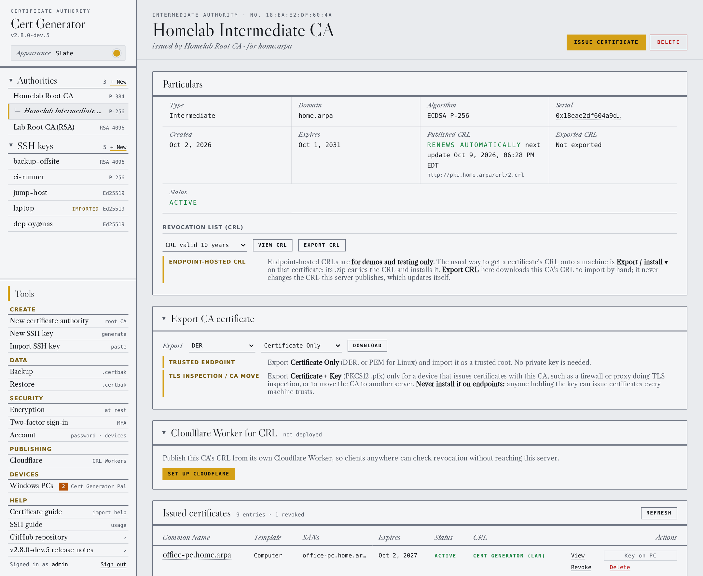

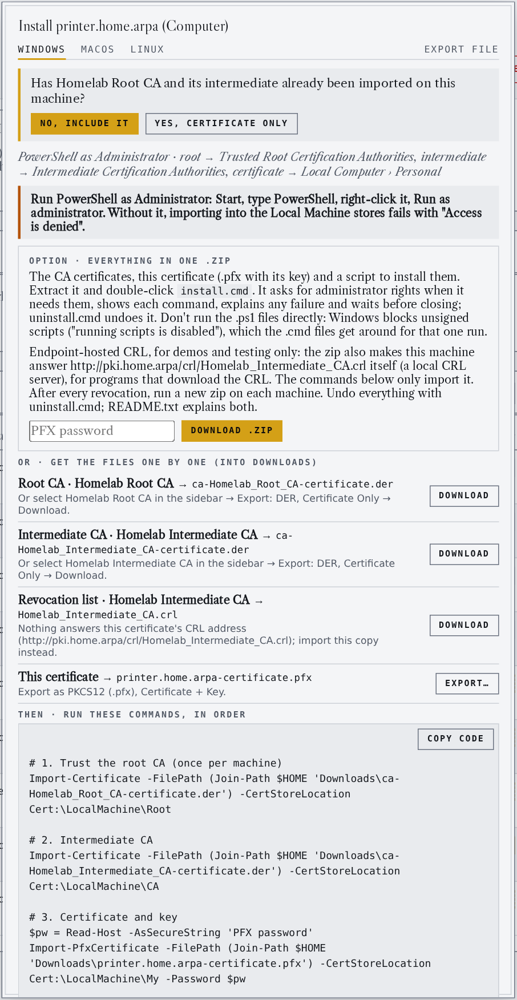 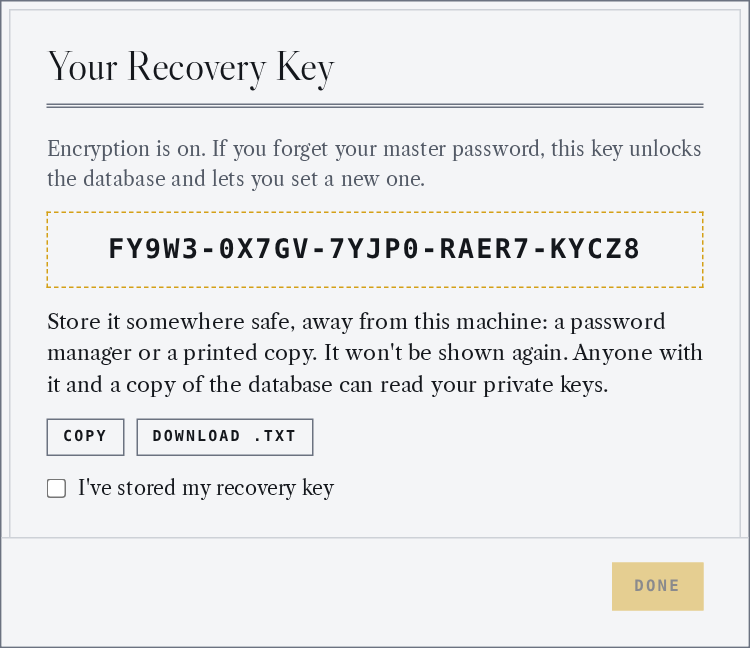

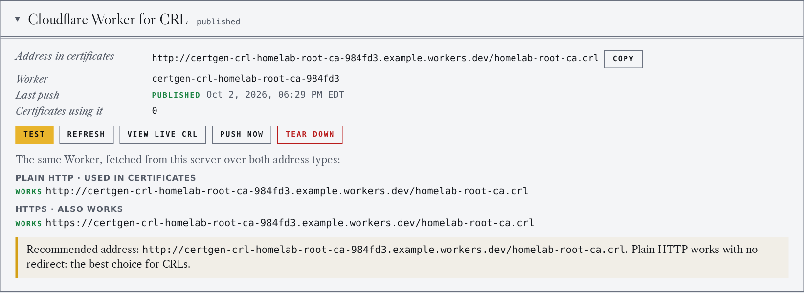

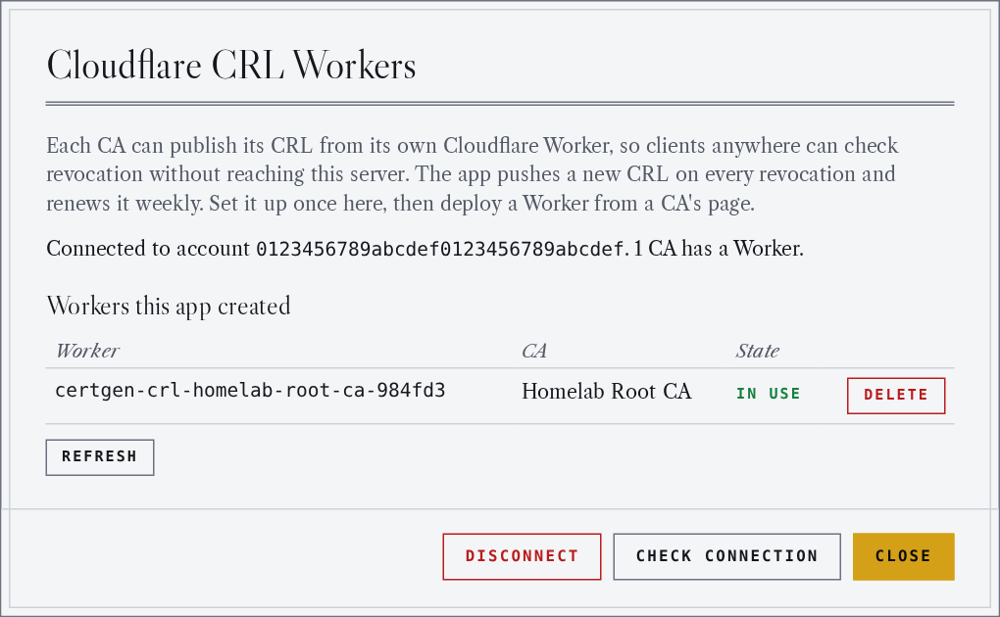 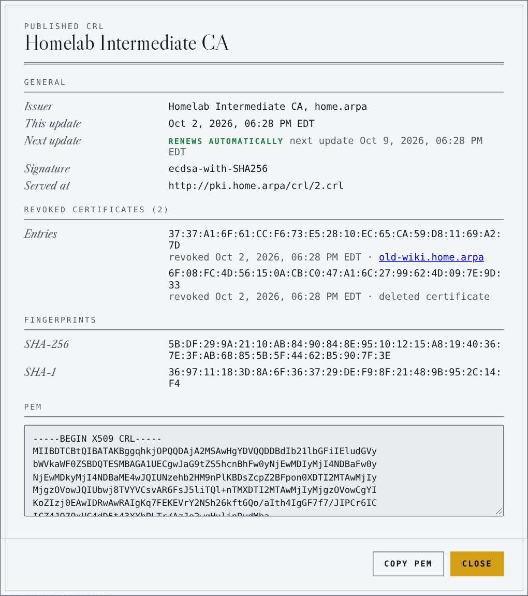

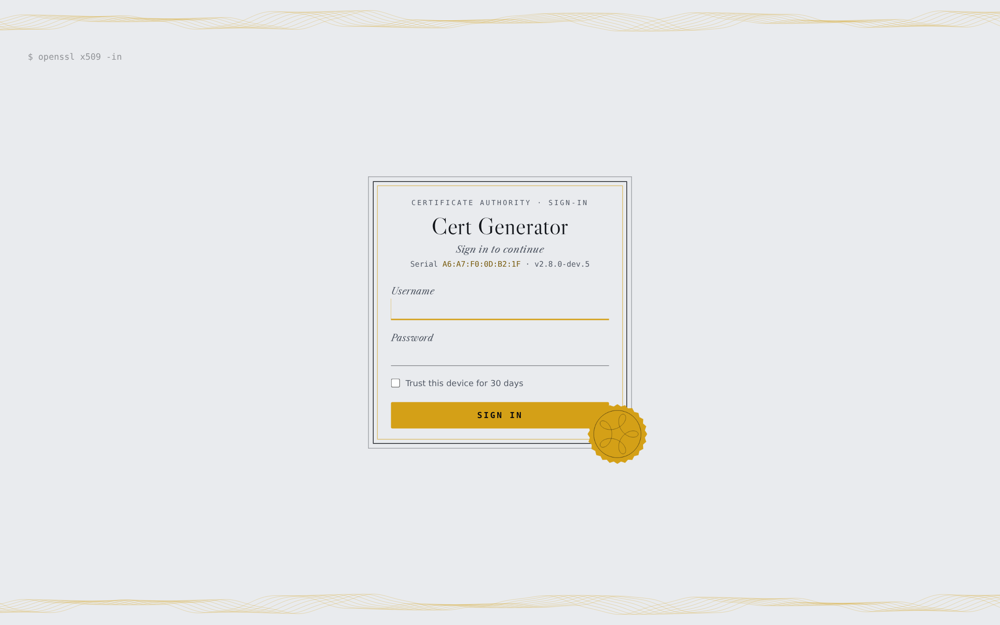 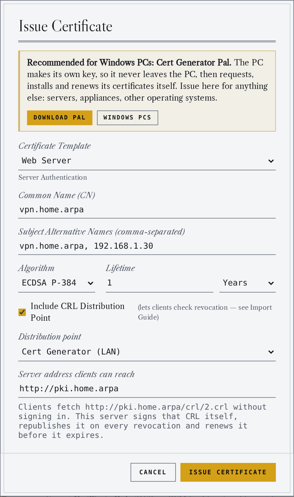

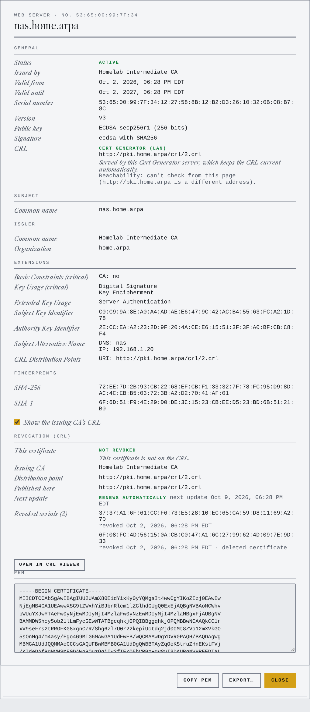 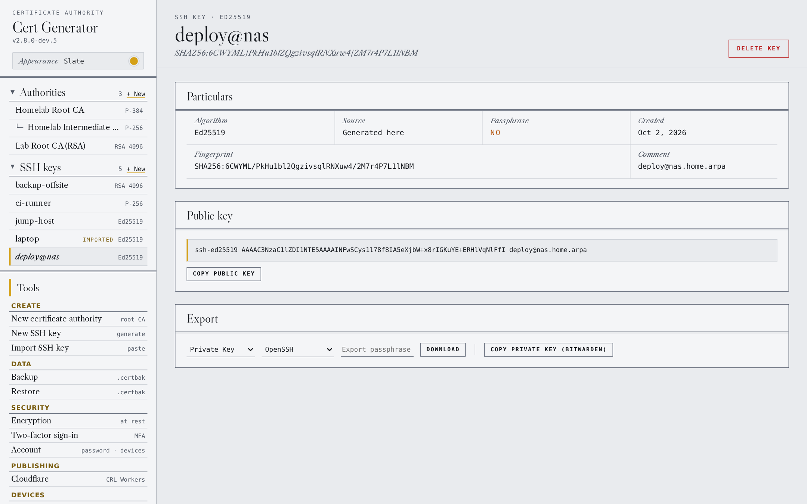

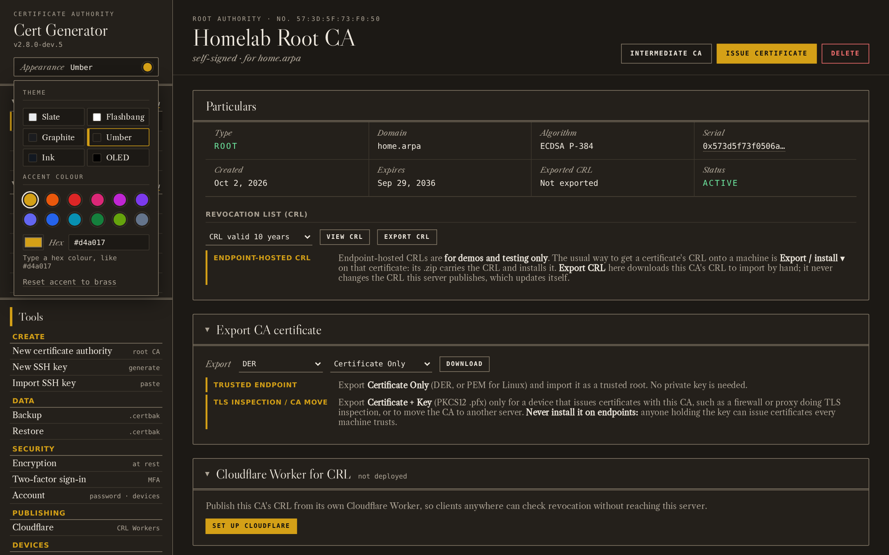


## Cert Generator Pal (Windows PCs)

Cert Generator Pal is a Windows companion app for the Docker version. You pair a PC with a **one-time pairing code**; from then on the PC asks your server for certificates, installs them in the right Windows store, and renews them near expiry, all in one click. **The private keys are made on the PC, never leave it, and can't be exported** (in the TPM when the PC has one). The server only ever sees certificate requests.

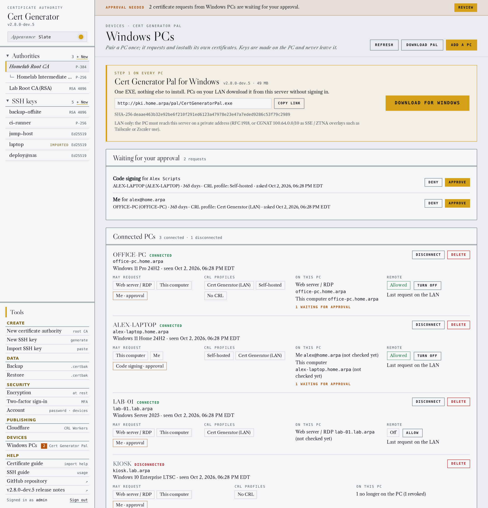

### What a PC can get

| In the Pal | Certificate | Installed in |
|---|---|---|
| **Web server / RDP** | TLS server certificate named after the PC, plus names you allow (IIS sites, Remote Desktop) | Local Computer › Personal |
| **This computer** | The computer's own certificate, named like a Windows CA names it (Wi-Fi, VPN, 802.1X) | Local Computer › Personal |
| **Me** | The signed-in user's client certificate (client authentication, smart card logon) | Current User › Personal |
| **Code signing** | Signing scripts and programs | Current User › Personal |
| **TLS inspection** | Trusts your CA for HTTPS inspection (no request) | Local Computer › Trusted Root |

Only what the pairing code allows appears. The CA chain is checked before every install and any missing root or intermediate is added. Binding a web server certificate to an IIS site or to Remote Desktop is still yours to do: the Pal installs it, with its key, ready to bind.

### Setting up a PC

1. **Get the app.** Open **Windows PCs** (sidebar, under Devices). The download card at the top has the EXE, its LAN address to copy, and its SHA-256. PCs on your LAN download it from your server without signing in. It is one file with nothing else to install, and it is **only** shipped inside the Docker image, with the same version as the server.
2. **Add a PC.** Choose **Add a PC** and set what this code allows:
   - **What the PC may request**: each kind is *Off*, *Issue right away* or *Needs my approval*.
   - **Allowed DNS names and addresses** (`*.home.arpa`, `10.0.0.0/24`) and **allowed user names** (`*@home.arpa`). The PC's own name must fit. Wildcard certificates are never issued to a PC.
   - **Longest lifetime**, how long the code works for, and the address the PC uses for this server.
   - **CRL profiles**: which revocation checks the PC may use: **Cert Generator (LAN)** (this server), **the CA's Cloudflare Worker**, **On each PC (self-hosted)** or **None**. Each one ticked becomes a CRL profile in the Pal.
   - **Allow remote connection**: whether the PC may use the [remote connection](#remote-connection-pcs-away-from-the-lan) once paired.
3. **Send the pairing code** to the PC the way you'd send a password. It is shown only once, works for one PC, and expires.
4. **On the PC**, run `CertGeneratorPal.exe` (it is unsigned, so Windows SmartScreen asks: choose **More info › Run anyway**), paste the code and choose **Connect**. Windows asks for administrator approval once, to trust your CA. The PC names itself from its own fully qualified name.
5. **Pick a CRL profile** in the Pal. Until you do, nothing can be requested: the profile decides where the PC's certificates check revocation.

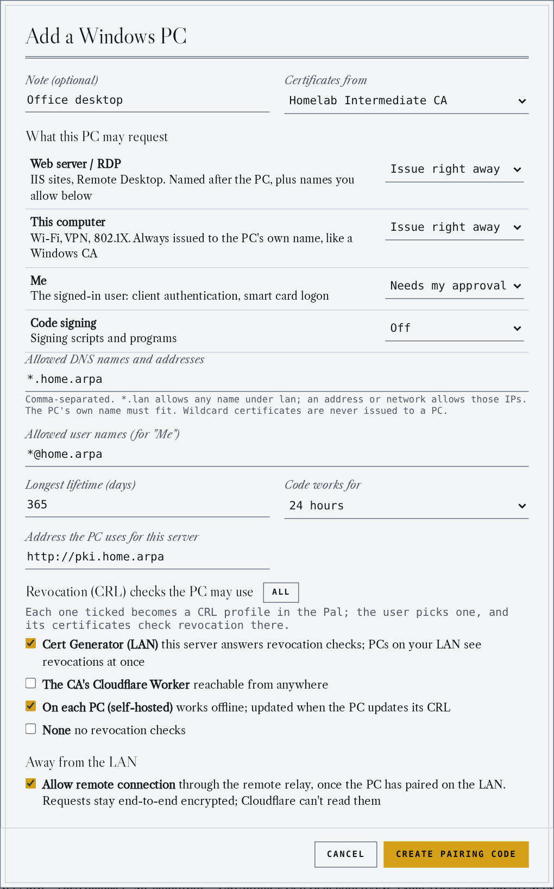 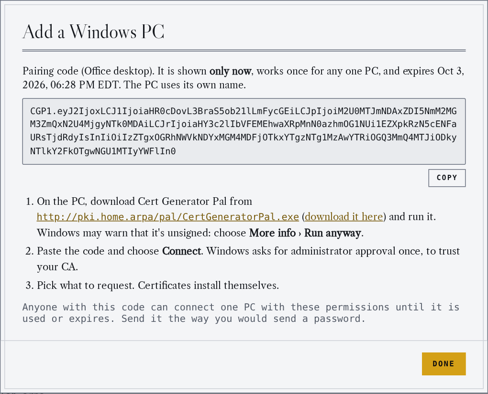

### Using the Pal

- **Request** with a tile. *Issue right away* installs the certificate in seconds. *Needs approval* waits for you: the request appears on the **Windows PCs** page with a banner and a count in the sidebar, and the Pal's **Check again** installs it once you approve.
- **The certificate list** shows every certificate on the PC that chains to your CA, in the user's and the computer's stores, with the server's view of each (valid, revoked, expired) and anything that needs a look. **Details** opens a full certificate view (every field and extension, the chain, where the key lives). **Remove** takes one or several out, with one administrator prompt for the computer's.
- **Renew** opens in a certificate's last 30 days (the last third for short-lived ones). Until then the button says how long is left. Renewing makes a new key and replaces the old certificate, which is then revoked.
- **One live certificate** per PC, kind and name: the server refuses duplicates and early renewals.
- **CRL profiles**: switching profile backs out the current one first (its certificates leave the PC); the root CA stays trusted. **Self-hosted** adds a small listener on the PC that answers its own revocation checks, for laptops away from the LAN; its tile shows only under that profile.
- **Connectivity** shows the cert server (over the LAN, and through the relay when the PC has one) and the CRL of the profile in use, each with a coloured status and **Test**. **Refresh** re-checks, and **Log** shows the Pal's log with a **Debug logging** switch (every request and check; never keys or pairing codes). The CRL profile is locked while the server can't be reached.
- **Disconnect this PC** removes the pairing and every certificate it installed.

The Pal keeps its pairings in `C:\ProgramData\CertGeneratorPal` (written only with administrator approval) and its log in `%LOCALAPPDATA%\CertGeneratorPal\pal.log`.

### Managing PCs

The **Windows PCs** page lists each PC with what it may request, its CRL profiles, what its last check-in found installed, its Pal version and how its last request arrived. From there you **approve or deny** requests, **allow or turn off** remote access, **Disconnect** a PC (it can't request again, and its certificates are revoked) or **Delete** it from the list. Pairing codes that haven't been used can be revoked. A PC whose Pal comes from another release is flagged, so you know to update it from the server.

### How it stays secure

- **Keys stay on the PC**, non-exportable, in the TPM when there is one. The server stores no Pal private keys.
- **Pairing** proves both sides hold the code's secret without sending it, and **pins your root CA**: a server or network in the middle can't plant another CA.
- **Every request is signed** by the PC's own device key, with a timestamp and a single-use nonce. What a PC may ask for is enforced by the server, not the app.
- **LAN only**: the server answers the Pal's API only from private addresses (RFC 1918, CGNAT `100.64.0.0/10` for SSE / ZTNA overlays such as Tailscale or Zscaler, link-local, IPv6 ULA), and the Pal connects only to such addresses. Don't publish `/api/pal/` through an internet-facing reverse proxy; use the remote connection instead.
- **Disconnecting** a PC revokes its certificates; a renewal revokes the certificate it replaces.

### Remote connection (PCs away from the LAN)

A PC allowed remote access keeps requesting and renewing when it isn't on your LAN, through a **relay Worker** on your Cloudflare account. **Nothing on your network opens to the internet**: your server connects *out* to the Worker and collects the requests waiting there.

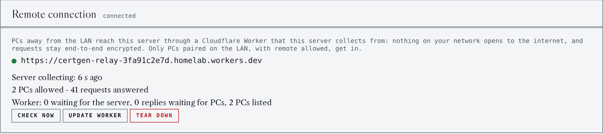

1. Turn on **database encryption** and connect **Cloudflare** (**Tools › Cloudflare**) if you haven't: the relay's keys are only ever stored encrypted.
2. On **Windows PCs › Remote connection**, choose **Set up remote connection**. It deploys a relay Worker on your `workers.dev` subdomain and the server starts collecting from it. **Check now** shows the server collecting within a minute.
3. **Allow** remote access for a PC on its card (or tick **Allow remote connection** when you make its pairing code).
4. The PC learns the relay the next time it checks in **on the LAN**. From then on, when the LAN can't be reached, each request goes through the relay instead. In the Pal, **Cert server · Remote** shows the relay, and **Connect to remote** uses only the relay for the session (to test it).

What Cloudflare sees: a PC's device id, sizes and times. Each request is **end-to-end encrypted** to a key only your server holds (a one-time P-256 key per request, AES-256-GCM), and each reply to a key only that request's sender can derive, so the Worker can't read, change or replay either. The Worker only takes envelopes signed by a PC you allowed, and **pairing never goes through the relay**. **Tear down** deletes the Worker; the relay key stays, so PCs pick up a new relay without pairing again.

### Troubleshooting

| The Pal says | What to do |
|---|---|
| **Wrong domain.** / **No DNS suffix.** | The PC's full name must fit the code's allowed DNS names; set the PC's primary DNS suffix, or allow its domain on a new code |
| **Code already used / expired / revoked.** | Make a new pairing code |
| **… isn't a LAN address.** | The server address resolves to a public address: use its LAN name or address (or set up the remote connection) |
| **Clock wrong.** | The PC's clock is more than 5 minutes off the server's |
| **Not allowed.** / **Revocation type not allowed.** | The pairing doesn't allow that; make a new code with it |
| **Too early to renew.** | Renewal opens in the certificate's last 30 days |
| **Remote access refused.** | Allow remote for the PC on the Windows PCs page; the relay hears about it within a minute |
| Windows SmartScreen blocks the EXE | It's unsigned: **More info › Run anyway**, after checking its SHA-256 on the Windows PCs page |

For anything else, turn on **Log › Debug logging** in the Pal and look at the log; the server's log has the matching entries. The design, protocol and relay envelope are documented in [docs/cert-generator-pal.md](docs/cert-generator-pal.md).

## Requirements

- Python 3.10+
- Windows 10/11 (desktop app) or Docker (server mode)

## Installation

```bash
pip install .
```

For the desktop app (pywebview), install with the desktop extra:

```bash
pip install ".[desktop]"
```

## Usage

### Docker (recommended)

**1. Create the data folder and move into it** (the container runs as UID 1000):

```bash
sudo mkdir -p /opt/docker/cert-generator && sudo chown 1000:1000 /opt/docker/cert-generator && sudo chmod 700 /opt/docker/cert-generator && cd /opt/docker/cert-generator
```

**2. Save this as `compose.yaml`** in that folder:

```yaml
services:
  cert-generator:
    image: ghcr.io/darthrater78/cert-generator:2.8.0-dev.5
    container_name: cert-generator
    restart: unless-stopped
    security_opt:
      - no-new-privileges:true
    ports:
      - "5000:5000"
    volumes:
      - /opt/docker/cert-generator:/data
    environment:
      - TZ=America/New_York
      - PORT=5000
      - SECRET_KEY=${SECRET_KEY:-}
      # - COOKIE_SECURE=true
      # - SETUP_TOKEN=${SETUP_TOKEN:-}

# image: pinned to a release. To upgrade, change the tag and run: docker compose pull && docker compose up -d
# no-new-privileges: the app never needs to gain privileges after it starts
# ports: the web UI on port 5000. Behind a reverse proxy, use "127.0.0.1:5000:5000" (see below)
#NOTE: this is only for scenarios where the proxy is on the same host as cert manager. 
# volumes: the database and exports live in /opt/docker/cert-generator on the host
# TZ: timezone for log timestamps
# PORT: the port the app listens on inside the container
# SECRET_KEY: signs session cookies; set it in .env (step 3) so sign-ins survive a restart
# COOKIE_SECURE: uncomment when the app is served over HTTPS
# SETUP_TOKEN: uncomment to require a token on the first-run setup page
```

**3. Set a session secret and start it:**

```bash
echo "SECRET_KEY=$(python3 -c 'import secrets; print(secrets.token_hex(32))')" >> .env && docker compose up -d
```

Open `http://<host>:5000` in your browser. On first launch you'll be prompted to create an admin account. The repository's [`docker-compose.yml`](docker-compose.yml) is the same file with longer comments, including the one-time account-recovery variables.

#### HTTPS and network exposure

The server speaks plain HTTP. For anything beyond a trusted LAN, put it behind a reverse proxy that terminates TLS (Caddy, nginx, Traefik), then:

- set `COOKIE_SECURE=true` so session and trusted-device cookies are only sent over HTTPS
- publish the port on loopback only (`"127.0.0.1:5000:5000"` in `compose.yaml`) so the proxy is the only way in
  NOTE: this is only for scenarios where the proxy is on the same host as cert manager. 
- set `SETUP_TOKEN` before first launch if the instance is reachable before you create the admin account

Proxies that rewrite the `Host` header should forward the original as `X-Forwarded-Host`; the cross-site request check accepts either.

#### Publishing the CRL

Certificates issued with the **Cert Generator (LAN)** distribution point (this server) name `<address>/crl/<CA id>.crl`, where `<address>` is the one typed in the Issue Certificate dialog (it defaults to the address you are using). That path is the only one that answers without signing in. The app signs that CRL itself the first time a certificate names this server, and keeps it current: each served CRL is valid for 7 days, it is re-signed on every revocation, and an hourly check renews it when less than half its life is left. Clients cache a CRL until its next update, so a revocation reaches them within 7 days. Nothing is signed per request. A CA's CRL is served only once a certificate has named this server, and unknown, unpublished and never-opted-in CAs all get the same `404`.

With an encrypted database, signing needs the CA key, so revoking a certificate of a CA served here is refused while the database is locked, and renewals wait until it is unlocked (the served CRL keeps answering meanwhile). **Export CRL** is for the endpoint-hosted distribution point and offline import: it downloads a CRL with the lifetime you choose and never replaces the one this server serves. After you revoke a certificate whose CRL is endpoint-hosted, or that has none, the app offers that updated CRL for download.

If clients reach the app through a reverse proxy, expose `/crl/` alone to them and keep everything else private. Allow only `GET` and `HEAD` on `^/crl/[0-9]+\.crl$`. Revocation checks are usually plain HTTP (clients don't fetch a CRL over HTTPS to avoid a circular check), so the CRL vhost is often HTTP while the admin UI stays on HTTPS.

nginx:

```nginx
server {
    listen 80;
    server_name pki.example.lan;

    location ~ ^/crl/[0-9]+\.crl$ {
        limit_except GET { deny all; }  # GET also allows HEAD
        proxy_pass http://127.0.0.1:5000;
    }
    location / { return 404; }
}
```

Traefik (compose labels on the `cert-generator` service):

```yaml
labels:
  - traefik.enable=true
  - traefik.http.routers.crl.rule=Host(`pki.example.lan`) && PathRegexp(`^/crl/[0-9]+\.crl$`) && (Method(`GET`) || Method(`HEAD`))
  - traefik.http.routers.crl.entrypoints=web
  - traefik.http.services.crl.loadbalancer.server.port=5000
```

The desktop app can't serve CRLs (it listens on loopback only), so it offers the endpoint-hosted distribution point alone.

#### Cloudflare Worker CRL

For clients that can't reach this server, each CA can publish its CRL from its own [Cloudflare Worker](https://developers.cloudflare.com/workers/), on Cloudflare's free plan. Everything happens in the app; there is no `wrangler` or command line. Docker only: the EXE never stores a Cloudflare token.

**1. Connect (once).** Turn on database encryption first: the API token can rewrite your CRL Workers, so it is only ever stored encrypted with the database key, and the app can't use it while the database is locked (encryption can't be turned off while Cloudflare is connected). Then open **Tools › Cloudflare** and follow its steps: create a custom API token in the Cloudflare dashboard with **Account · Workers Scripts · Edit** on your account only (for an address on your own domain, add **Zone · Zone · Read**, **Zone · Workers Routes · Edit** and **Zone · DNS · Edit** for that one zone), and paste it with your account ID. The token is checked with Cloudflare and never shown again.

**2. Deploy per CA.** On the CA page, the **Cloudflare Worker for CRL** card deploys a Worker for that CA at `certgen-crl-<CA>-<random>.<your subdomain>.workers.dev`, or at a hostname on one of your Cloudflare domains (Cloudflare creates the DNS record). Pick an address you'll keep: it is written into every certificate issued with it. Then issue certificates with **Include CRL Distribution Point › Cloudflare Worker (this CA)**.

**3. Test.** **Test** fetches the CRL from the Worker over plain HTTP and HTTPS, from this server, and checks that it parses, is signed by the CA, is current and matches what the app last pushed. It recommends the address to put in certificates: plain HTTP with no redirect where that works, since Windows and most clients fetch CRLs over HTTP. **View live CRL** opens the CRL the Worker is serving in the CRL viewer, and **Copy** gives the address for your own testing (`certutil -url`, `openssl crl`).

**Keeping it current.** The CRL is built into the Worker, so publishing is a redeploy. Revoking a certificate asks to confirm and pushes the new CRL; the hourly renewal re-signs and pushes it before it runs out (7-day CRLs, renewed at half-life); **Push now** does it by hand. A failed push shows **not published** on the CA page and in the log, and is retried hourly. **Refresh** re-reads the Worker and checks it still exists in Cloudflare.

**Tear down** deletes the CA's Worker (and its custom domain) after a confirmation that says how many certificates carry its address, since they lose their working CRL. **Tools › Cloudflare** lists every `certgen-crl-*` Worker in the account as **in use**, **unlinked** (in Cloudflare, but no CA here uses it: a deleted CA, a failed setup, a restore or another install of the app) or **missing** (a CA here names a Worker Cloudflare no longer has), with **Delete** and **Delete unlinked**. **Disconnect** deletes the stored token (delete it in the Cloudflare dashboard too); it needs a recent sign-in and is refused while any CA still has a Worker, since the app could no longer update or remove it.

**Security.** The Worker's code is fixed and contains no secrets: it answers `GET` and `HEAD` on its one CRL path, `404`/`405` for anything else, sets no cookies and no CORS headers, and sends `nosniff` and a `default-src 'none'; sandbox` CSP. Nothing on it can write; changing the CRL takes the API token, which stays encrypted in this app's database. A CRL is public by design and signed by the CA, so a Worker can't forge one.

#### Endpoint-hosted CRL, for endpoints that can't reach Docker or Cloudflare (Windows)

A certificate with the **endpoint-hosted** distribution point names `http://pki.<domain>/crl/<CA name>.crl`, an address no server on the network answers. (Older versions called it *placeholder*; the API value is still `placeholder`.) Windows' own revocation check can still use a CRL imported into the certificate store, but programs that download the CRL from that address (some agents, browsers, Java, OpenSSL-based tools) get nothing. For endpoints that can reach neither this server nor a Cloudflare Worker, the Windows install bundle makes the endpoint answer that address itself.

**Get it:** on the certificate, open **Export / install ▾**, choose **Windows**, answer the CA question, and use **Download .zip**. For an endpoint-hosted certificate the zip holds the CRL, `install.cmd` / `install.ps1`, `uninstall.cmd` / `uninstall.ps1`, `serve-crl.ps1` and a `README.txt` that repeats everything below.

**Install:** extract the zip anywhere and double-click **`install.cmd`**. It asks for administrator rights, shows each command before running it, stops with an explanation if a step fails, and waits for Enter before the window closes. It's safe to run again.

The scripts are unsigned, so Windows' default execution policy blocks running `install.ps1` directly ("running scripts is disabled on this system"). `install.cmd` isn't subject to that policy: it starts the script with the policy bypassed for that one run, and your setting doesn't change. The PowerShell equivalent is `powershell -ExecutionPolicy Bypass -File .\install.ps1`. If Windows warns that the publisher can't be verified, choose **Run**; unblocking the .zip first (**Properties › Unblock**) avoids the warning. A Group Policy that enforces `AllSigned` overrides the bypass; then run the commands from **Export / install** by hand.

Besides the certificate (and the CAs, if included), it changes only:

| What | Where | Why |
|---|---|---|
| Hosts entry `127.0.0.1 pki.<domain> # cert-generator` | `C:\Windows\System32\drivers\etc\hosts` | Sends the CRL's host name to this machine, and only on this machine |
| The CRL, `serve-crl.ps1`, `crl-hosts.txt` | `C:\ProgramData\CertGenerator` | Writable by Administrators and SYSTEM only, readable by LOCAL SERVICE |
| CRL import | Local Machine › Intermediate Certification Authorities | For Windows' own revocation check |
| URL reservation for `http://pki.<domain>:80/crl/` | `netsh http show urlacl` | Lets LOCAL SERVICE answer that one path, nothing else |
| Scheduled task **Cert Generator CRL server** | Task Scheduler | Starts the listener at boot as LOCAL SERVICE |

The listener is a few lines of PowerShell on Windows' built-in HTTP.sys (the same component IIS uses, so it shares port 80 with IIS). It answers `GET` and `HEAD` for `/crl/<name>.crl` from that folder and `404` for everything else. Several CAs and domains share one listener. The script finishes by downloading the address itself and stops with an error if nothing answers. Check it any time with `certutil -verify -urlfetch <certificate.cer>`.

**After a revocation:** nothing updates the endpoint's copy by itself. Download a new bundle and run its `install.cmd`: it replaces the CRL and restarts the listener. Until then the endpoint doesn't see the revocation.

**Back out:** double-click **`uninstall.cmd`** in the same extracted folder (keep it for this). Like the install, it asks for administrator rights, shows each step and waits before closing; it carries on past a failed step and lists what it couldn't remove. From PowerShell:

```powershell
powershell -ExecutionPolicy Bypass -File .\uninstall.ps1            # asks before removing CA certificates
powershell -ExecutionPolicy Bypass -File .\uninstall.ps1 -RemoveCA  # removes them without asking
```

It removes the certificate, the imported CRL, the hosts line, the URL reservation and this domain from the listener. With the last domain gone it also deletes the scheduled task and `C:\ProgramData\CertGenerator`. Use the `uninstall.ps1` from the last bundle you installed: it names the current CRL. To back out by hand: delete the `# cert-generator` line from the hosts file, run `netsh http delete urlacl url=http://pki.<domain>:80/crl/`, delete the **Cert Generator CRL server** task and `C:\ProgramData\CertGenerator`, and remove the certificate and CRL in `certlm.msc`.

**Security notes**

- **Exposure:** HTTP.sys accepts the request on any interface, but Windows Firewall blocks inbound port 80 unless you open it, and the only thing served is the CRL, which is public by design.
- **Tampering:** a CRL is signed, so it can't be forged, but an older valid copy could hide a revocation. That's why the folder is admin-only. If it already exists and isn't owned by Administrators (any user can create folders in `C:\ProgramData`), or is a link, the install moves it aside as `CertGenerator.untrusted-<time>` and starts fresh, so nobody else can swap the script the listener runs. The listener runs as LOCAL SERVICE, not SYSTEM, and may use only the reserved path.
- **Freshness** is the real weakness: an endpoint that isn't given the new CRL keeps trusting a revoked certificate until the old CRL expires.
- **Security tools** may flag the hosts-file edit and the new startup task. That is this install; undo it with `uninstall.cmd`.
- **Port 80** taken by a program that doesn't use HTTP.sys (Apache, nginx, some Docker setups) stops the listener. `install.cmd` reports it.
- **A system-wide proxy** (`netsh winhttp show proxy`) needs `pki.<domain>` on its bypass list.

macOS and Linux bundles include the CRL file, but the local CRL server is Windows-only for now.

### Standalone EXE (Windows desktop)

Download `CertGenerator.exe` from the [latest release](https://github.com/darthrater78/cert-generator/releases/latest). Double-click to run — no Python installation needed. The desktop app runs as a native window, and no network port is exposed.

On first run the app offers to **protect it with a username and password**. That turns on database encryption with the password as the master password, so the app asks for both at every start and a copied database file can't be read. Next it shows a one-time **recovery key**: if you forget the password, the sign-in screen takes the key, sets a new password and shows your username. You can skip it (**Not now**, or **Don't ask again**) and turn it on later in **Encryption** settings.

The EXE offers only the endpoint-hosted CRL distribution point. To serve a CRL that clients fetch, run the Docker version and move your data across with Backup and Restore.

The EXE is not code-signed, so Windows SmartScreen shows a warning on first run. To confirm the file is the one GitHub Actions built from this repository, compare it with the release's `CertGenerator.exe.sha256`, or verify its build attestation with the [GitHub CLI](https://cli.github.com/):

```bash
gh attestation verify CertGenerator.exe --repo darthrater78/cert-generator
```

To build it yourself on Windows:

```bash
pip install -r requirements-desktop.txt
python build.py
dist\CertGenerator.exe --self-test result.json
```

`--self-test` exercises the packaged app against a throwaway database without opening a window and writes the results to `result.json`; `--self-test-gui` also opens and checks the real window.

### Server mode (without Docker)

For running the web app directly without Docker:

```bash
pip install .
python -m app.serve
```

Opens on `http://0.0.0.0:5000`. Same login and UI as Docker. Configure with environment variables:

| Variable | Default | Description |
|----------|---------|-------------|
| `PORT` | `5000` | Server port |
| `HOST` | `0.0.0.0` | Bind address |
| `SECRET_KEY` | random | Session secret (set for persistent sessions; an empty value also means random) |
| `COOKIE_SECURE` | `false` | Set `true` when served over HTTPS so cookies are HTTPS-only |
| `SETUP_TOKEN` | — | If set, the first-run setup page requires this token |
| `DB_DIR` | `~/.cert-generator` | Database directory |
| `EXPORT_DIR` | `~/Downloads` | Desktop mode only: where exports are saved. Server mode sends exports straight to the browser |
| `LOG_LEVEL` | `INFO` | Logging level (DEBUG, INFO, WARNING, ERROR) |
| `RESET_PASSWORD` | — | One-time: reset a user's password (`username:newpassword`), clear their trusted devices, and end their sessions |
| `RESET_MFA` | — | One-time: disable MFA, clear trusted devices, and end sessions for a user |

### Desktop app (from source)

```bash
pip install ".[desktop]"
python -m app.main
```

This opens a native window with the full UI. App token authentication is handled automatically.

### Running tests

```bash
pip install -r requirements-dev.txt
python -m pytest
```

Browser tests drive the real UI (downloads, sign-out, CRL export, mobile layout) with Playwright and check for JavaScript and Content-Security-Policy errors:

```bash
pip install -r requirements-e2e.txt
python -m playwright install --with-deps chromium firefox webkit
python -m pytest -m e2e --browser chromium --browser firefox --browser webkit
```

Security scans before a release: Bandit and pip-audit come with `requirements-dev.txt`, and [Trivy](https://github.com/aquasecurity/trivy/releases) (a standalone binary) scans a built image with the same config CI uses:

```bash
bandit -r app -c pyproject.toml
pip-audit -r requirements.txt -r requirements-desktop.txt
docker build -t cert-generator:dev . && trivy image --config trivy.yaml --ignorefile .trivyignore.yaml cert-generator:dev
```

Editing a file under `.github/workflows/`? Lint it the same way CI does:

```bash
bash scripts/lint-workflows.sh
```

CI runs on every push and pull request to `master`:
- the unit tests on Linux (Python 3.10 and 3.14) and Windows
- the browser tests in Chromium, Firefox, and WebKit
- a Windows EXE build and its `--self-test` / `--self-test-gui` checks (the EXE is kept as a workflow artifact for 7 days)
- a Docker image build with a container smoke test, including a clean shutdown on `docker stop`, and a Trivy scan of the image's OS and Python packages (report only)
- `actionlint` against `.github/workflows/**` (only runs when those files change)
- dependency review on pull requests, which fails a PR that adds a dependency with a known high or critical advisory

A change that touches only documentation (`*.md`, `docs/**`, `LICENSE`) skips the tests, browser tests, EXE build and image build: a first `detect changes` job decides with `scripts/ci-changes.sh`, and the skipped jobs still report as passing, so required checks and the release workflow's CI check are satisfied. If that job fails or can't tell what changed, everything runs.

### Releases

Pushing a `vX.Y.Z` tag on `master` runs `.github/workflows/release.yml`. Before building anything, it requires a passing CI run for the tagged commit — an in-progress run is waited on, but a missing or failed one stops the release. Both deliverables share one version line, and the changelog decides which of them a release publishes: the version's entry in this README's version history must carry a `#### Docker` section, a `#### Windows EXE` section, or both, and at least one is required.
- **Docker image** — built once and pushed by digest; that digest is smoke-tested and scanned with Trivy (a fixable high or critical vulnerability in an OS or Python package stops the release, and the scan is uploaded to the Security tab), and only then tagged in `ghcr.io/darthrater78/cert-generator` as `X.Y.Z`, `X.Y`, and — only when the release includes Docker and is the newest — `latest`, with a build provenance attestation
- **Windows EXE** — built and self-tested on Windows, attached to the GitHub release with a SHA-256 checksum and a build provenance attestation

Whichever deliverable the entry lists is built, and the release is created only once those succeed. A deliverable with no section is not rebuilt: it stays at the version it last shipped, and the notes say so ("Docker image unchanged (2.1.0)"). GitHub's **Latest** release follows the newest release that includes the EXE, so `/releases/latest/download/CertGenerator.exe` always resolves to the current build.

## Server hardening

The embedded web server is hardened for both desktop and server use:

**Desktop mode (pywebview):**
- **Loopback only** — binds to `127.0.0.1`, never exposed to the network
- **Random port** — uses an ephemeral port each launch, not a fixed port
- **App token authentication** — a random token is generated at startup and set as an httpOnly cookie via the pywebview window; requests without the cookie are rejected with 403, preventing access from other browsers on the same machine
- **Auto-shutdown** — the server thread is daemonic and shuts down when the window closes

**Server mode (Docker / standalone):**
- **Login authentication** — on first launch, you create an admin account (optionally gated by `SETUP_TOKEN`); all subsequent access requires sign-in with username and password (bcrypt-hashed, session-based)
- **Brute-force protection** — repeated failed passwords, MFA codes, encryption passwords, or recovery keys lock that account's attempts for 1 minute, doubling up to 15 minutes. Trusted devices are unaffected
- **TOTP MFA** — optional second factor via any authenticator app; enable per-user from MFA Settings. Each code is accepted only once
- **Trusted devices** — "Trust this device" sets an httpOnly cookie with a SHA-256 hashed token; auto-login skips password and MFA for 30 days unless "Require password every visit" is enabled. Signing out forgets the device
- **Session revocation** — password resets, MFA changes, "Revoke all devices", and backup restores end every other session
- **Step-up confirmation** — private-key downloads (CA and certificate keys, any bundle that includes a key, SSH private keys in any format), backup and restore require a password or authenticator-code sign-in within the last 5 minutes; otherwise the page asks for one and retries. Confirmations share the sign-in lockout, and a trusted-device auto-login doesn't count as one. Desktop mode has no accounts (its optional sign-in is the encryption password) and is exempt
- **Session cookies** — httpOnly, `SameSite=Lax`, signed with `SECRET_KEY`; `Secure` when `COOKIE_SECURE=true`
- **Cross-site request protection** — state-changing requests from other sites are rejected (using `Sec-Fetch-Site`, falling back to `Origin`)
- **Internal API** — the routes under `/api/` are the page's own API, authenticated by the session cookie. They are not a stable public interface and can change between releases
- **Cloudflare token** — stored only encrypted with the database key (connecting requires encryption), never returned by the API, unusable while the database is locked, and scoped by you to Workers Scripts (plus one zone for a custom domain). Cloudflare calls go only to `api.cloudflare.com` with certificate verification
- **Public CRL path** — `/crl/<id>.crl` is the one unauthenticated route. It accepts only `GET` and `HEAD`, serves only CAs that opted in by issuing a certificate pointing at this server, answers unknown and unpublished CAs with the same `404`, never reads or sets a session cookie, sends the CRL as an attachment under `Content-Security-Policy: default-src 'none'` with an `ETag`, and is rate limited to 300 requests a minute per client address
- **Security headers** — a Content-Security-Policy that allows no inline script (`script-src 'self'`), `X-Frame-Options: DENY`, `nosniff`, and `Cache-Control: no-store` on API responses
- **No key material on the server's disk** — exports and backups stream to the browser instead of being written to an export folder. If an older version left export files in `EXPORT_DIR`, a banner offers to review and delete them (only files matching the old export names are touched)
- **Clean shutdown** — `docker stop` ends the server immediately instead of waiting for its timeout
- **Patched, minimal image** — the image applies Debian security updates at build time rather than waiting for the base image to be rebuilt, and drops `pip` (with the libraries it bundles) once the app's dependencies are installed

**Both modes:**
- **Encryption fails closed** — while an encrypted database is locked, anything that would store a private key is refused rather than written in plaintext
- **Clean exit** — `sys.exit(0)` after the UI closes ensures proper cleanup

### Account recovery

If you lose your password or MFA authenticator, use environment variables to reset on the next container start. These run once at startup — remove them afterward.

**Reset a password:**

```bash
# Docker
docker compose exec cert-generator env RESET_PASSWORD=admin:newpassword python -m app.serve &
# Or add to compose.yaml environment section, restart, then remove it
```

**Disable MFA for a locked-out user:**

```bash
# Docker
docker compose exec cert-generator env RESET_MFA=admin python -m app.serve &
# Or add to compose.yaml environment section, restart, then remove it
```

**Without Docker:**

```bash
RESET_PASSWORD=admin:newpassword python -m app.serve
RESET_MFA=admin python -m app.serve
```

`RESET_MFA` disables TOTP, clears all trusted devices, and turns off "Require password every visit" for the named user. `RESET_PASSWORD` also clears the user's trusted devices. Both end every existing session for that user, so recovering from a compromised account locks the intruder out. Neither variable affects database encryption — the master encryption password is separate from the login password.

With both MFA and database encryption enabled, the MFA page asks for the encryption password after a restart, because the MFA secret is encrypted too. Entering it also unlocks the database. If you've forgotten it, **Forgot it? Use your recovery key** on the same page takes the recovery key and a new encryption password instead.

### Forgotten encryption password

The account-recovery variables can't help here: nobody can decrypt the keys without the master password or the **recovery key**. The recovery key is shown once when you enable encryption, as five groups of five characters (`K7QM2-XR4TD-…`). Store it away from the server, in a password manager or on paper. Anyone with it and a copy of the database can read your private keys.

- **To use it**, choose **Forgot it? Use your recovery key** on the unlock screen (or on the MFA page), enter the key and a new master password. The database unlocks, and a **new recovery key** replaces the one you typed, which stops working. Case, spaces and dashes don't matter.
- **To replace it** (lost, or possibly seen), open **Encryption** settings and choose **Replace recovery key** with your current password. The old key stops working.
- **Databases encrypted before v2.6.0** have no recovery key. Their next unlock upgrades them to the new format, and a banner offers **Create recovery key**.
- Changing the master password keeps the recovery key valid. Disabling encryption removes it.

This works the same in Docker and the Windows EXE. In the EXE, if you set a username, recovery also shows it.

### Quick start

1. Launch the app (Docker: `docker compose up -d`, Desktop: run `CertGenerator.exe`)
2. Server mode: create your admin account on first launch, then sign in. Desktop: choose whether to protect the app with a username and password
3. With no CA yet, the **Certificate Import Guide** opens on its Quick Start. **Open in new window** keeps it beside the app while you work
4. Click **+ New** next to **Authorities** (or **Tools › Create › New certificate authority**) and enter a domain name (e.g. `example.com`) and lifetime
5. Select your CA in the sidebar
6. Click **Issue certificate** to generate leaf certs
7. To trust the CA on a machine, **Download** it from the CA page: the default, **DER · Certificate Only**, is the file an endpoint needs
8. Click **Export / install ▾** on a certificate for step-by-step install commands or a .zip with install scripts, or its **Export file** tab to download it in the format you choose
9. Docker: for Windows PCs, open **Windows PCs**, download **Cert Generator Pal** and choose **Add a PC**: the PC then requests and installs its own certificates (see [Cert Generator Pal](#cert-generator-pal-windows-pcs))
10. Docker: to publish a CA's CRL on the internet, connect **Tools › Cloudflare** and deploy a Worker from the CA page (see [Cloudflare Worker CRL](#cloudflare-worker-crl))
11. Click **+ New** next to **SSH keys** to generate an SSH key pair, or **Tools › Create › Import SSH key** to add an existing key

## Supported algorithms

| Algorithm | Key type | Hash |
|-----------|----------|------|
| Ed25519 | EdDSA | Built-in |
| ECDSA P-256 | Elliptic curve | SHA-256 |
| ECDSA P-384 | Elliptic curve | SHA-384 |
| RSA-2048 | RSA | SHA-256 |
| RSA-4096 | RSA | SHA-384 |

## Export formats

| Format | Extension | Contents |
|--------|-----------|----------|
| PEM | `.pem` | Base64-encoded, widely supported |
| DER | `.der` | Binary format |
| CRT | `.crt` | DER-encoded with Windows-native extension |
| PKCS12 | `.pfx` | Bundled cert + key, password required |

Export options per certificate:
- **Certificate + Key** — full bundle
- **Certificate Only** — public certificate
- **Private Key Only** — private key
- **Full Chain** — leaf cert + issuing CA cert + root CA cert (PEM only, for leaf certs)

A CA's export defaults to **DER · Certificate Only**, which is all an endpoint needs to trust the CA. Export a CA's **Certificate + Key** only for a device that issues certificates with it, such as a firewall or proxy doing TLS inspection, or to move the CA to another server; never install it on endpoints. CA files are named after the CA (`ca-<CA name>-certificate.der`), certificate files after the common name (`<common name>-certificate.pfx`).

## Data storage

All CAs, certificates, and SSH keys are stored in a SQLite database. When database encryption is enabled, all private keys (and the MFA secrets) are encrypted at rest with AES-256-GCM under a random 256-bit data key. The database stores that key only wrapped: once with a key derived from the master password (Scrypt), and once with one derived from the recovery key (HKDF; the recovery key is 125 random bits). Changing the password re-wraps the data key without re-encrypting anything. Backups are separate: a `.certbak` holds the decrypted data, sealed with the backup password you choose.

| Mode | Database path | Exports path |
|------|--------------|--------------|
| **Desktop** | `~/.cert-generator/certs.db` | `~/Downloads/` |
| **Docker** | `/data/db/certs.db` (host: `/opt/docker/cert-generator/db/`) | Downloaded by your browser; nothing is kept on the server |

The database format is identical in both modes. Use **Backup** to create an encrypted `.certbak` file on one and **Restore** to load it on the other — this is the supported way to migrate data between Docker and desktop.

## Version history

Each entry lists its changes per deliverable: a `#### Docker` section means the image is published for that version, a `#### Windows EXE` section means the EXE is built and attached, and anything under another heading (such as `#### Internal`) is carried into the notes as-is. Entries before v2.1.0 predate the split and shipped both.

### v2.8.0-dev.5 — 2026-10-02

Fifth pre-release: **Cert Generator Pal uses the remote relay**. A PC allowed remote connection requests and renews certificates away from your LAN. Not for production.

#### Docker
- **Pal (served by this image) — remote connection:** a PC paired on the LAN with remote allowed learns the relay's address and key from your server. When the LAN can't be reached, each request goes through the relay instead, end-to-end encrypted to your server's relay key; a refusal from your server is never retried through the relay
- **Pal — Connectivity:** a **Cert server · LAN** row and a **Cert server · Remote** row, each with status, time and **Test**; **Connect to remote** uses only the relay for the session (to test it, or when the LAN shouldn't be used) and **Use LAN first** switches back. The CRL profile stays available while either route answers
- The Pal only takes relay details from your server over the LAN (or in its pairing reply), never through the relay itself

### v2.8.0-dev.4 — 2026-10-02

Fourth pre-release: the server side of the **remote relay** for Cert Generator Pal, to try against a real Cloudflare account. The Pal doesn't use the relay yet (that comes next). Not for production.

#### Docker
- **Download the Pal** from the top of the Windows PCs page: a download card with the LAN link to copy and the SHA-256; the page header and the Issue Certificate dialog offer it too
- **Remote connection** (Windows PCs page): **Set up** deploys a relay Worker on your `workers.dev` subdomain. Paired PCs away from the LAN will reach this server through it, while **nothing on your network opens to the internet**: the server collects from the Worker over outbound HTTPS. Needs database encryption on and Cloudflare connected. **Check now** shows whether the server is collecting; **Update Worker** and **Tear down** manage it
- Requests through the relay are **end-to-end encrypted** to a key only this server holds (a one-time key per request, ECDH P-256, AES-256-GCM): Cloudflare can't read, change or replay them, and the Worker accepts only envelopes signed by a PC you allowed
- **Allow remote connection** on a pairing code, and an **Allow / Turn off** switch per PC (off by default); each PC shows whether its last request came over the LAN or through the relay. Pairing is LAN only, never through the relay

### v2.8.0-dev.3 — 2026-10-02

Third pre-release for testing Cert Generator Pal. Not for production.

#### Docker
- **Issue Certificate** recommends Cert Generator Pal for Windows PCs (the key never leaves the PC; it requests, installs and renews itself), with a **Windows PCs** button; issuing by hand stays for servers, appliances and other systems
- The **This server** CRL option is now **Cert Generator (LAN)**: in the Issue dialog, the CRL column, the Windows PCs page, Add a PC and the Pal's CRL profiles

### v2.8.0-dev.2 — 2026-10-02

Second pre-release for testing Cert Generator Pal on a real PC. Not for production.

#### Docker
- **CGNAT addresses count as LAN:** the Pal API and the Pal accept `100.64.0.0/10` along with RFC 1918, so PCs and servers on SSE / ZTNA overlays such as Tailscale or Zscaler can pair and request
- **Pal (served by this image) — Connectivity:** one row for the **cert server** (a signed request, timed) and one for the **CRL profile in use**, each with a coloured status and a **Test** link; **Refresh** re-checks both, and **Log** shows the Pal's log with a **Debug logging** switch (every request and check; never keys or pairing codes)
- **Pal — no CRL profile until you pick one:** after pairing the dropdown reads *None: pick a CRL profile*, and nothing can be requested until one is chosen. The CRL profile is locked while the cert server can't be reached
- **Pal — certificate view:** values line up and are never cut off, long labels wrap, and the window resizes. **Copy PEM** is gone (it could crash when another program held the clipboard); **Save…** writes PEM or .cer
- **Pal:** request tiles keep their status colour when disabled (red when the server can't be reached), and an unexpected error is logged and shown as a short message instead of the .NET crash dialog

### v2.8.0-dev.1 — 2026-10-02

Pre-release for testing Cert Generator Pal against a real server. Not for production: pairings and Pal-issued certificates made with it may need redoing before v2.8.0, and this README documents the Pal fully in v2.8.0.

#### Docker
- **Cert Generator Pal (preview)**, a Windows companion app: **Windows PCs** (sidebar, under Devices) › **Add a PC** makes a single-use pairing code that says what the PC may request (web server / RDP, this computer, the signed-in user, code signing; each issued at once or after your approval) and which CRL profiles it may use. The PC makes its own keys, so they never leave it, requests and installs certificates in one click, and renews them near expiry. LAN only
- The Pal ships only inside the Docker image, served at `/pal/CertGeneratorPal.exe` to PCs on your LAN with no sign-in needed. It always carries the server's version: the Windows PCs page and the Pal itself warn when a PC runs a Pal from another release
- **Windows PCs** page: each PC with what it may request, its CRL profiles and what is installed on it right now; approve or deny requests; disconnect or delete a PC (its certificates are revoked). Requests waiting for approval show a count in the sidebar and a banner, checked every minute
- Issued certificates: a **Refresh** button, and the row actions line up whether a certificate offers Export or has its key on a PC
- Fixed: a library's error text could reach the browser on a failed export, SSH key import, encryption change or restore; those now answer with the app's own message

### v2.7.0 — 2026-10-01

#### Docker
- **Cloudflare Worker CRL distribution point.** Each CA can publish its CRL from its own Cloudflare Worker, set up entirely in the app: **Tools › Cloudflare** connects an API token (stored encrypted, so database encryption must be on), and the CA page's **Cloudflare Worker for CRL** card deploys the Worker on `workers.dev` or your own domain, then offers **Test**, **Refresh**, **Push now**, **View live CRL**, **Copy** and **Tear down**. Issue certificates with **Distribution point › Cloudflare Worker (this CA)**. See [Cloudflare Worker CRL](https://github.com/darthrater78/cert-generator#cloudflare-worker-crl)
- **Test** fetches the Worker's CRL over plain HTTP and HTTPS from this server, checks its signature, freshness and that it matches the last push, and recommends the address for certificates
- Revoking a certificate of a CA with a Worker says the new CRL will be published there and pushes it; the hourly renewal pushes too. A failed push shows **not published** on the CA page and in the log, and is retried hourly
- **Tools › Cloudflare** lists every Worker the app created in the account as in use, unlinked or missing, with **Delete** and **Delete unlinked**. Tear down and Disconnect say what they affect before they run
- The Worker is fixed, read-only code: `GET`/`HEAD` on its one CRL path, nothing else, no secrets, cookies or CORS
- **Export / install ▾** replaces Endpoint import: one panel per certificate with **Windows**, **macOS**, **Linux** and an **Export file** tab (the old Export dialog). All commands sit in one block with **Copy code**, and Windows says when PowerShell must run as Administrator
- **Download .zip** per OS: the certificate, the CA chain if the machine doesn't have it, the CRL for an endpoint-hosted certificate, and install / uninstall scripts that find their own folder, show each command and explain failures. On Windows, `install.cmd` / `uninstall.cmd` ask for administrator rights, get past the unsigned-script block for that one run, and wait for Enter before closing
- **Endpoint-hosted** is the new name of the *placeholder* distribution point, and it is for demos and testing only. On Windows, its .zip also makes the endpoint answer the CRL address itself (a hosts entry and a small HTTP.sys listener running as LOCAL SERVICE), and `uninstall.cmd` backs it all out. See [Endpoint-hosted CRL](https://github.com/darthrater78/cert-generator#endpoint-hosted-crl-for-endpoints-that-cant-reach-docker-or-cloudflare-windows)
- **No default export passwords.** The pre-filled `changeit` is gone and refused by the server; a PKCS12 export needs a password you choose
- The CA page's **Export CA certificate** and **Cloudflare Worker for CRL** are cards you can fold away, remembered per browser; the CRL note points to the certificate's Export / install as the usual way to get a CRL onto a machine
- The certificate guides fit the window, their tabs wrap instead of scrolling, and **Open in new window** pops a guide out beside the app. The Quick Start opens by itself while there are no CAs yet
- Fixed: the password confirmation opened behind the Encryption dialog when creating a recovery key from **Encryption** settings
- The Windows local CRL server won't reuse a `C:\ProgramData\CertGenerator` folder that someone else created (or a link): it moves it aside, so a non-admin user can't swap the script that runs at boot
- Fixed: the issued-certificates table ran past its card between about 1400 and 1500px wide, hiding Delete; and on phones a long CRL address pushed a Download button off the Export / install panel
- README screenshots retaken, with new ones for Export / install and the Cloudflare Worker

#### Windows EXE
- **Optional sign-in.** On first run the app offers to protect it with a username and password, which become the database encryption password, followed by a one-time recovery key that resets the password and shows the username. **Not now** and **Don't ask again** skip it
- The window opens maximized, so the whole layout fits on scaled (125–150%) displays
- The same Export / install panel, .zip bundles, endpoint-hosted rename and Windows local CRL server, no default export passwords, foldable CA cards, adaptive and pop-out guides, Quick Start on first run and the fixes above as Docker. The CRL options say the served distribution point and Cloudflare need the Docker version

#### Internal
- The browser tests close the Quick Start that now opens on an empty database; a new test covers it. The pop-out guide drops its handle on the app window, with tests for the guide page's headers, path allowlist and the desktop app token
- Tests run the Cloudflare flow against a fake Cloudflare API, and CI's Windows job parses the generated PowerShell scripts
- The Cloudflare and install-bundle routes show only the app's own error messages; any other error is logged and answered generically

### v2.6.0 — 2026-10-01

#### Docker
- **Encryption recovery key.** Enabling database encryption now shows a one-time recovery key (five groups of five characters) with **Copy** and **Download .txt**, and asks you to confirm you've stored it. If you forget the master password, **Forgot it? Use your recovery key** on the unlock screen takes the key and a new password, unlocks the database, and issues a new recovery key; the used one stops working. See [Forgotten encryption password](https://github.com/darthrater78/cert-generator#forgotten-encryption-password)
- With MFA and a locked database, the MFA page offers the same recovery: the authenticator code, the recovery key and a new encryption password. The new recovery key is shown once on the next page
- **Encryption** settings can replace the recovery key (with your current password), which revokes the old one
- **Existing encrypted databases upgrade on their next unlock**: the keys are re-encrypted under a random data key, and a banner offers **Create recovery key**. Until you create one, a forgotten password still means the keys are lost
- Changing the master password no longer re-encrypts every key; it re-wraps the data key, and the recovery key stays valid
- Wrong recovery keys count toward the same lockout as wrong encryption passwords
- **Endpoint import for each certificate.** An **Endpoint import ▾** button on every valid certificate opens the commands to install it on a machine, with **Windows**, **macOS** and **Linux** tabs and **Copy commands**. It first asks whether the root CA (and any intermediate) is already on that machine: **No** gives the whole workflow, trust chain first, with a **Download** button for each CA file the commands use; **Yes** gives just the certificate step. Either way, **Export…** opens this certificate's export in the format the commands expect. The commands follow the certificate's template and chain, with Windows stores per Microsoft's layout: the root CA in Trusted Root Certification Authorities, an intermediate in Intermediate Certification Authorities, Computer and Web Server certificates in Local Computer › Personal, and Client Auth, User, Email and Code Signing in Current User › Personal (Code Signing adds Trusted Publishers). macOS uses the System and login keychains; Linux uses the system CA bundle, `/etc/ssl` for server certificates and the NSS database for user certificates. File names match what **Export** downloads
- **CA exports are named after the CA** (`ca-<CA name>-certificate.der`) instead of its domain, so a root and an intermediate that share a domain no longer download to the same file name
- **The CA's Export defaults to DER · Certificate Only**, the file an endpoint needs to trust the CA. A note under it explains the two cases: **Trusted Endpoint** (Certificate Only, no key) and **TLS Inspection / CA Move** (Certificate + Key, only for a device that issues certificates with this CA, never on endpoints).
- The CA page groups its controls under **Export CA certificate** and **Revocation list (CRL)**, and the Import Guide's Quick Start points to Endpoint import
- **Export CRL** now says on the page that it's for the placeholder distribution point only and never changes the CRL this server publishes
- The issued-certificates table fits narrower windows: below 1700px the row actions take two rows, and below 1400px the Algorithm column (shown in the viewer) steps aside, so Revoke and Delete are never pushed out of view
- README screenshots retaken for this version, with new ones for Endpoint import and the recovery key
- Dialog buttons (Close, Export…, Copy PEM and the rest) stay pinned at the bottom of the dialog while long content, such as the certificate viewer, scrolls
- The sidebar's **Tools** stand out and are grouped by use: Create, Data, Security, Help; the sidebar is more compact, so more of it fits without scrolling
- On phones, warning banners show one line with **More**, so they no longer fill the screen
- The Certificate and SSH guides have a bolder, clearer tab bar (shorter labels: S/MIME, CRL) and section headings with an accent bar, so they're easier to scan

#### Windows EXE
- The same recovery key, unlock-screen recovery, replace option and upgrade of existing encrypted databases as Docker. **Download .txt** is browser-only; the EXE offers **Copy**
- The same Endpoint import, pinned dialog buttons, CA export default and key warning, CA export names, Export CRL note (placeholder only, as the EXE doesn't serve CRLs), grouped Tools and guide styling as Docker
- The built-in self-test now covers unlocking with the recovery key

#### Internal
- Every change to the encryption key settings runs under SQLite's write lock, so two simultaneous unlocks of a pre-2.6.0 database can't upgrade it twice with different keys

### v2.5.0 — 2026-10-01

#### Docker
- **Certificate viewer.** Click an issued certificate's name, or its new **View** button, to see what's inside it: subject and issuer, validity to the minute, serial, key type and signature algorithm, every extension (SANs including UPN, key usage, extended key usage, basic constraints, key identifiers, CRL distribution points), SHA-256 and SHA-1 fingerprints, and the PEM with a **Copy PEM** button. **Export…** opens the usual export dialog. The private key is never sent to the viewer
- **Show the issuing CA's CRL** — a checkbox in the viewer adds the CA's revocation list: whether this certificate is revoked, the CRL distribution point it carries (or a note that it has none), the CRL's next update, and every revoked serial with this certificate's highlighted. It reads what's already there
- **The CRL distribution point can be this server.** When issuing a certificate with **Include CRL Distribution Point**, choose **This server** or **Placeholder URL (offline import)**. This server writes `<address>/crl/<CA id>.crl` into the certificate (the address is pre-filled from the page you're on and can be changed to one your clients reach) and opens that path, without sign-in, for the CA. See [Publishing the CRL](#publishing-the-crl) for exposing only that path through nginx or Traefik. Requests that set the old `include_crl_dp` flag still get the placeholder
- **The served CRL keeps itself current.** This server signs a 7-day CRL for each CA it serves, re-signs it on every revocation and renews it hourly once less than half its life is left, so clients see a revocation within 7 days without any exporting. **Export CRL** now only downloads a file for offline import and never changes what is served. Revoking a certificate of a served CA needs the database unlocked
- **Revoking says what happens next**: for a certificate pointing at this server, nothing to do; for a placeholder or no distribution point, the app offers the updated CRL for download to import on each machine
- **CRL viewer.** **View CRL** on the CA page, or **Open in CRL viewer** in the certificate viewer, shows the published CRL: issuer, this and next update, signature, each revoked serial linked to its certificate, fingerprints and PEM, with **Copy PEM**. For a CA this server doesn't publish for, it lists the revocations an export would contain. The CA page now shows the **Published CRL** and the **Exported CRL** separately
- **Confirm it's you before key material leaves.** Downloading any private key, copying an SSH private key, backing up and restoring ask for your password (or an authenticator code with MFA) unless you signed in within the last 5 minutes. Trusted-device auto-login doesn't count, and confirmations share the sign-in lockout
- `/api/` is documented as the page's internal API (session-authenticated, not a stable contract)
- **A CRL column** in the certificate table shows where each certificate's CRL comes from (None, Placeholder, This server, Not published, External), and the viewer's CRL row adds whether the URL answers from your browser
- **Deleting a revoked certificate keeps it on the CRL** until it would have expired, so deleting never un-revokes it; the viewer marks such serials as "deleted certificate". Deleting a certificate that isn't revoked now warns that clients keep trusting it until it expires. Backups carry these entries and each CA's published CRL
- The in-app Import Guide's CRL tab covers both distribution points, automatic publishing and the CRL viewer
- After sign-in the first certificate authority opens right away. Previously the "No authorities yet" screen stayed up until you picked a CA, even when you had some, and it came back after deleting the open CA
- Restoring a backup now keeps each CA's CRL next-update date instead of resetting it to "Not exported"
- The image picks up Debian security updates at build time (fixes OpenSSL CVE-2026-75804 and CVE-2026-84782, and PCRE2 CVE-2026-103111, ahead of the upstream `python:3.14-slim` rebuild) and no longer ships `pip`, which removes the copies of urllib3, msgpack and setuptools it bundled

#### Windows EXE
- The same certificate viewer, CRL section, first-CA-on-load fix and restore fix as Docker
- The same CRL column, deleted-revocation handling, delete warning, revoke guidance, CRL viewer and Import Guide update. The desktop app can't serve CRLs, so its Issue Certificate dialog offers the placeholder distribution point only. It has no accounts, so it doesn't ask you to confirm before key material leaves

#### Internal
- The image's Trivy scans (CI and release) now cover Python packages as well as OS packages, so a library bundled by the base image can no longer slip past them
- CI skips the tests, browser tests, EXE build and image build when a change touches only documentation
- Bandit and pip-audit come with `requirements-dev.txt`, and the README lists the local scan commands (Bandit, pip-audit, Trivy)
- The page no longer reports an error when a reload cuts off a request still loading (it made a Firefox browser test flaky)

### v2.4.0 — 2026-09-29

#### Docker
- A full visual refresh. The dashboard is set like a registry of issued documents: serif headings, monospace for serials, dates and fingerprints, and ruled, framed sections instead of soft cards, gradients and glows. The sidebar is an index with **Authorities** and **SSH keys** as headed sections, each with a count and a **+ New** link, and intermediates drawn under their root. A selected CA's header shows its serial and what issued it; issued certificates read as a register, with status set as text, revoked entries struck through and anything expiring within 30 days flagged. Emoji are gone from the interface
- Six themes: **Slate** (the new default, a soft light grey), **Flashbang** (white), and four darks — **Graphite**, **Umber**, **Ink** and **OLED** (pure black)
- An **Appearance** menu under the title holds the theme list and the accent colour: twelve presets, a colour picker, an editable hex field (`#d4a017`, `d4a017` or `#fa0`) and a reset. The choice is saved per browser, applies on the sign-in pages too, and the accent's text and button-text shades are derived automatically so both stay above WCAG AA contrast on every theme
- The default accent is now brass (`#d4a017`), the gold of a certificate seal, instead of indigo. Indigo is still one of the presets
- Redesigned sign-in, first-run setup and MFA pages — the card is set like an engraved certificate (double rule, a fresh decorative serial on every visit, and a seal), over slowly shifting guilloché bands and a faint `openssl x509 -text` readout. The readout is fixed sample text, never data from your store. Animation stops when your system asks for reduced motion and idles while the tab is hidden
- The unencrypted-keys and old-exports warnings now run across the top of the page instead of crowding the sidebar, and the sidebar scrolls as a whole on short screens so no list or the sign-out link is ever cut off

#### Windows EXE
- The same refresh, themes, Appearance menu and accent picker as Docker — the desktop build bundles the same templates (the redesigned sign-in pages are Docker-only; the desktop app has no login)

#### Internal
- The release workflow builds the image once, smoke-tests and Trivy-scans that exact digest, and only then applies the version tags; CI adds a report-only Trivy scan and a dependency-review check on pull requests
- `docker-compose.yml` pins the image to the release version instead of `latest`
- The README's Docker section is now a copy-paste quickstart: create the data folder, save `compose.yaml`, set the session secret and start
- README screenshots redone for the new design, rendered from sample data and kept in `docs/screenshots/`

### v2.3.2 — 2026-09-16

#### Docker
- Fixed low-contrast algorithm/type badges (e.g. "RSA 4096", the CA type tag) — badge text used the same accent hue as its own translucent background tint, landing below WCAG AA contrast in both OLED Black and Flashbang. Badge text now uses a dedicated, theme-aware shade.

#### Windows EXE
- Same badge contrast fix as Docker — the desktop build bundles the same templates, so both deliverables ship identically

### v2.3.1 — 2026-09-16

#### Docker
- OLED Black theme contrast fix — brighter surface/border tokens and a redesigned shadow/glow so panel edges, modal shadows, and focus rings stay visible against the pure-black background
- Removed the indigo "Dark" theme option — only OLED Black and Flashbang remain, switchable from the sidebar swatch control, with OLED Black as the default

#### Windows EXE
- Same theme fixes as Docker — the desktop build bundles the same templates, so both deliverables ship identically

### v2.3.0 — 2026-09-16

#### Docker
- **Theme switcher** — OLED black and "Flashbang" white themes alongside the existing indigo-dark default, switchable from a sidebar swatch control; the choice persists across sessions (`localStorage`) and applies consistently on the dashboard and the login/setup/MFA screens
- Subtle animated title shimmer and swatch glow accents

#### Windows EXE
- Same theme switcher and visual accents as Docker — the desktop build bundles the same templates, so both deliverables ship identically

### v2.2.0 — 2026-09-16

#### Docker
- **Visual refresh** — gradient buttons and wordmarks, card/modal depth via shadows, focus-glow rings on inputs, a modal open/close animation, and colored accent borders on toasts and status badges, across the dashboard and the login/setup/MFA screens
- Fixed the MFA screen's encryption-password field (shown when the database is locked): it had no CSS rule at all and rendered as an unstyled browser-default input

#### Windows EXE
- Same visual refresh as Docker — the desktop build bundles the same templates, so both deliverables ship identically

#### Internal
- The release workflow now requires a passing CI run for the tagged commit before building or publishing anything, waiting out an in-progress run rather than treating it as a failure — protects against tagging a commit CI hasn't checked yet
- `.github/workflows/*.yml` are linted with `actionlint` in CI whenever they change (`scripts/lint-workflows.sh`)
- Branch protection enabled on `master`

### v2.1.0 — 2026-09-14

Resolves #15, #16, #17, #18, #19, and #20.

**Docker and the Windows EXE now share one release line.** The EXE was never published before, so this release rebuilds the image at 2.1.0 — unchanged in behaviour from 2.0.0 apart from the fixes below — to bring both deliverables onto the same version. From here on a release publishes whichever of the two its changelog entry lists, and the other stays where it is.

#### Docker
- **CRL lifetime is configurable** (#15) — choose 7 days to 10 years when exporting a CRL (default stays 10 years); the CA page shows the CRL's next-update date and warns when it is expired or due within 30 days
- **No inline script** (#16) — the page script moved to `/static/app.js` and inline event handlers were replaced, so the Content-Security-Policy now forbids inline script
- **Old export cleanup** (#17) — a banner lists files that versions before 2.0.0 left in `EXPORT_DIR` and deletes them on confirmation; unrelated files, subfolders, and symlinks are left alone
- **Clean shutdown** (#19) — the server handles SIGTERM, so `docker stop` returns in under a second instead of waiting 10 seconds
- **Browser-tested UI** (#20) — Playwright tests cover every download, sign-out, CRL export, restore, the unlock screen, and the mobile menu in Chromium, Firefox, and WebKit
- Image builds are smoke-tested before publishing and carry a build provenance attestation

#### Windows EXE
- **Released as a download** — releases that include the desktop app attach `CertGenerator.exe`, built and tested by GitHub Actions on Windows, with a SHA-256 checksum and a verifiable build provenance attestation (not code-signed)
- **pywebview 6.2.1** (from 5.3.2) and pinned PyInstaller 6.22.3
- **Self-test mode** — `CertGenerator.exe --self-test` and `--self-test-gui` check the packaged app against a throwaway database; CI runs both on every change
- Static files (including the app icon) are now bundled; previously `/static` was missing from the EXE
- Same CRL lifetime option (#15), page script changes (#16), and UI fixes as the Docker image

#### Internal
- `app/server.py` split into blueprints (`auth`, `account`, `pki`, `ssh`, `settings`) with shared helpers in `app/web.py`; long functions broken up (#18)
- CI adds Windows unit tests, browser tests, the EXE build and self-test, and a container smoke test; `release.yml` builds the Docker image and the EXE from one tag, and `scripts/release_notes.py` decides which of them a release publishes from this changelog

### v2.0.0 — 2026-09-14

**Security**
- Database encryption fails closed: while locked, creating or importing keys returns an error instead of storing them unencrypted
- Login, MFA, and encryption-password attempts are rate limited; TOTP codes cannot be replayed
- Cross-site request protection, `SameSite=Lax` session cookies, optional `COOKIE_SECURE`, and CSP / frame / nosniff headers in server mode
- Sessions can be revoked: password resets, MFA changes, "Revoke all devices", and restores end other sessions; signing out forgets the trusted device
- Server-mode exports stream to the browser instead of accumulating unencrypted keys in `/data/exports`
- Optional `SETUP_TOKEN` for first-run setup; setup can no longer race to create two admins
- Constant-time token comparison and exact Origin matching in desktop mode; username timing no longer reveals valid accounts
- Request size capped at 32 MB; concurrent Scrypt derivations limited
- Dependencies pinned to exact versions; Docker base image pinned by digest; release workflow actions pinned by SHA, tag-on-default-branch check, and `latest` only moves for the newest release
- CI now runs tests on Python 3.10 and 3.14 and builds the image on every push and pull request

**Fixed**
- MFA users could not sign in after a restart with database encryption enabled (500 error), and `RESET_MFA` crashed at startup in that state
- An empty `SECRET_KEY` from Docker Compose broke setup and login
- Intermediate CAs could be created under intermediates with path length 0, producing invalid chains; deleting a root with a three-level hierarchy failed
- Full-chain export now includes every issuer up to the root
- IP addresses in SANs are encoded as IP addresses, not DNS names; invalid SAN entries are rejected
- CRLs record the actual revocation time instead of the issue time
- Passwords longer than 72 bytes caused a 500 with bcrypt 5; MFA disable no longer trims the login password
- Malformed JSON request bodies return 400 instead of 500; database connections are closed; encryption password changes run in a single transaction

**Behavior changes**
- `GET /api/download` is removed. In server mode, export, CRL, and backup endpoints return the file itself (`Content-Disposition: attachment`) instead of JSON with a server path. Desktop mode is unchanged
- PKCS12 exports without a password return 400 instead of silently using `changeit`
- Sign out is now a POST; visiting `/logout` directly returns to the app
- Resetting a password clears that user's trusted devices; enabling or disabling MFA and "Revoke all devices" sign out other sessions
- Creating an intermediate under an intermediate returns 400
- Files left in `/data/exports` by earlier versions are not deleted automatically; the server logs a warning at startup if any exist

### v1.9.0 — 2026-09-04

- **Account Settings panel** — new sidebar button providing a standalone settings view independent of MFA; "Require password every visit" toggle moved here from the MFA Settings modal so it's accessible without MFA enabled
- **Per-device trusted device management** — trusted devices now show browser and OS labels (auto-detected from user-agent); view individual devices with creation and expiry dates; revoke devices individually or all at once from Account Settings or MFA Settings
- Fixed device label detection for iPhone/iPad user agents that were incorrectly identified as macOS

### v1.8.0 — 2026-09-03

- **Account recovery via environment variables** — reset a locked-out user's password (`RESET_PASSWORD=user:newpass`) or disable their MFA (`RESET_MFA=user`) by setting environment variables before starting the server; resets run once at startup, then the app continues normally
- `RESET_MFA` disables TOTP, clears all trusted devices, and turns off "Require password every visit" for the named user
- Neither reset variable affects database encryption — the master encryption password is separate from the login password
- Annotated `docker-compose.yml` with commented examples for both reset variables

### v1.7.1 — 2026-09-03

- **Fixed Docker build** — added missing `pyotp` and `qrcode` dependencies that caused `ModuleNotFoundError` on container startup
- **Dockerfile now installs from requirements.txt** instead of a hardcoded package list, preventing future dependency drift between the manifest and the container
- Updated `requirements.txt` to match current `pyproject.toml` server dependencies

### v1.7.0 — 2026-09-03

- **TOTP multi-factor authentication** — enable a TOTP second factor from the new MFA Settings panel in the sidebar; scan the QR code with any authenticator app (Google Authenticator, Authy, 1Password, etc.) and enter a verification code to confirm setup; requires both password and TOTP code to disable
- **Trusted devices** — "Trust this device for 30 days" checkbox on login and MFA verification pages; trust tokens are SHA-256 hashed and stored server-side; revoke all trusted devices from MFA Settings
- **Require password every visit** — opt-in setting (off by default) that forces password entry on each visit even with a trusted device; toggle from MFA Settings
- TOTP secrets are encrypted at rest when database encryption is enabled
- Trusted device cleanup runs automatically on login to remove expired tokens
- Backup/restore preserves MFA settings (TOTP secret, enabled state, require-password preference); trusted devices are not backed up (they are per-device and ephemeral)

### v1.6.0 — 2026-09-02

- **SSH key import** — import existing SSH private keys from Bitwarden or other sources via the new "Import SSH Key" button; supports OpenSSH, PEM PKCS#8, PEM traditional, and DER formats with automatic algorithm detection and optional passphrase
- Imported keys are visually distinguished with an "IMPORTED" badge in the sidebar and a "Source: Imported" indicator in the detail view
- Imported keys are fully functional — export, copy, backup/restore all work identically to generated keys
- Added `imported` column to the SSH keys database schema (auto-migrated on upgrade)

### v1.5.1 — 2026-09-02

- **Structured logging** — request logging (method, path, status, duration) and operation logging (CA/cert/SSH key create/delete, login, backup/restore); configurable via `LOG_LEVEL` environment variable
- **Expandable serial numbers** — click to expand/collapse full serial in the CA details view
- Fixed SSH key details grid overflow — fingerprint and long values now wrap properly
- Fixed `python` → `python3` in SECRET_KEY generation command (compose and README)
- Uncommented `SECRET_KEY` in compose since login is on by default
- Rewrote README to clarify Docker and desktop as equal deployment options with full feature parity and portable backups

### v1.5.0 — 2026-09-02

- **Docker deployment** — run as a web server with `docker compose up`, GitHub Actions CI builds and pushes to GHCR on every version tag; non-root container with `no-new-privileges`
- **Login authentication** — username/password login for server mode; first launch prompts for admin account creation, bcrypt-hashed passwords, Flask session-based auth
- **Server mode** — production WSGI entry point (`python -m app.serve`) using Waitress; configurable via `PORT`, `HOST`, `SECRET_KEY`, `DB_DIR`, `EXPORT_DIR` environment variables
- **Browser downloads** — exports in server mode trigger browser file downloads instead of saving to the local filesystem
- **Structured logging** — request logging (method, path, status, duration) and operation logging (CA/cert/SSH key create/delete, login, backup/restore); configurable via `LOG_LEVEL` environment variable
- **Expandable serial numbers** — click to expand/collapse full serial in the CA details view
- Moved `pywebview` to an optional `[desktop]` extra — server/Docker installs don't pull GUI dependencies
- Added `waitress` dependency for production WSGI serving

### v1.4.0 — 2026-09-01

- **SSH key management** — generate, store, export, and copy SSH key pairs (RSA 4096/2048, Ed25519, ECDSA P-256/P-384) with optional passphrase protection; in-app SSH guide with tabs for Bitwarden, Linux/macOS, Windows, and GitHub/GitLab
- **Database encryption at rest** — encrypt all private keys (CA, certificate, and SSH) with AES-256-GCM using a master password derived via Scrypt; unlock screen on startup, password change, and disable/re-enable support
- **Backup and restore** — export all CAs, certificates, and SSH keys to a single AES-256 encrypted `.certbak` file; restore replaces all data from a backup
- **App token authentication** — the pywebview app now generates a random session token and sets it as an httpOnly cookie, rejecting requests from any other browser on the same machine
- **Collapsible sidebar sections** — Certificate Authorities and SSH Keys sections can be collapsed/expanded, with item counts
- Added `bcrypt` dependency (required by `cryptography` for SSH key passphrase encryption)
- Upgraded `cryptography` from 44.0.3 to 50.0.1 (8 CVE fixes)
- Upgraded `flask` from 3.1.1 to 3.1.3 (1 CVE fix)

### v1.3.0 — 2026-08-31

- **User certificate template** — Client Authentication + Smart Card Logon EKU, with Microsoft UPN OtherName in the SAN and email address in subject/SAN, for Windows smart card logon, 802.1X, and VPN use cases
- **CRT export format** — DER-encoded `.crt` files that Windows recognizes natively (double-click to view or import); available for both CA and leaf certificate exports
- **Offline CRL generation** — opt-in "Include CRL Distribution Point" checkbox when issuing certificates embeds a CDP extension with a placeholder URL; "Export CRL" button on the CA page generates a signed `.crl` file for manual import into the Windows certificate store, providing offline revocation status without a live CRL/OCSP server
- Added User and CRL (Revocation) tabs to the in-app import guide
- Revoke endpoint now returns a reminder to re-export the CRL

### v1.2.1 — 2026-08-26

- Added a GitHub Repo link in the sidebar, opening in the system's default browser
- Exposed a `js_api` (`open_external`) from the pywebview window, restricted to an https-only, github.com-only allowlist

### v1.2.0 — 2026-08-26

- Fixed PKCS12 export for Windows — PFX files now use `BestAvailableEncryption` with a password (default: `changeit`) instead of `NoEncryption()`, which Windows rejected
- Optional CA chain inclusion — issued cert exports no longer bundle the CA certificate by default; an "Include CA chain" checkbox lets you opt in
- In-app import guide — tabbed guide with step-by-step instructions for each certificate template (Computer, Web Server, Client Auth, Code Signing, Email) covering Windows, macOS, and Linux
- Added Windows certificate store tip explaining that the import wizard shows only "Personal" (not "Personal > Certificates") and this is expected
- PKCS12 is now the default export format for both CA and issued certificate exports
- Password field pre-filled with default and visible `(default: changeit)` label on both CA and cert export UIs
- Refined delete button styling — outlined ghost style instead of solid red

### v1.1.0 — 2026-08-25

- Intermediate CA support — create subordinate CAs from any root CA that can issue their own certificates
- Hierarchical sidebar tree view showing root and intermediate CAs
- Full chain export now includes the complete chain (leaf + intermediate + root)
- Cascade delete — removing a root CA also deletes its intermediates and their certificates
- Days/Years unit selector for certificate lifetime inputs
- Fixed export/download — certificates now save directly to the Downloads folder
- Fixed responsive layout issues with header wrapping and modal clipping
- Sanitized export filenames to prevent path traversal
- Replaced `os._exit(0)` with `sys.exit(0)` for proper cleanup on exit

### v1.0.0 — 2026-08-25

First stable release with a distributable Windows EXE.

- Certificate templates (Web Server, Computer, Client Auth, Code Signing, Email) with correct X.509 extensions
- Password-protected exports for PEM private keys and PKCS12 bundles
- Hardened embedded server: random ephemeral port, loopback-only, CSRF origin check, clean shutdown on window close
- Standalone single-file Windows EXE via PyInstaller (`build.py`)
- App icon
- Responsive UI layout for narrow window widths

### v0.1.0 — 2026-08-25

Initial release.

- Certificate Authority creation with configurable domain, name, algorithm, and lifetime
- Leaf certificate issuance with SAN and wildcard support
- Certificate tracking with status display (active/revoked/expired)
- Export to PEM, DER, and PKCS12 formats with part selection
- Support for Ed25519, ECDSA P-256/P-384, and RSA-2048/4096
- Certificate revocation
- Dark-themed web UI with native Windows desktop wrapper (pywebview)
- SQLite-backed persistent storage
